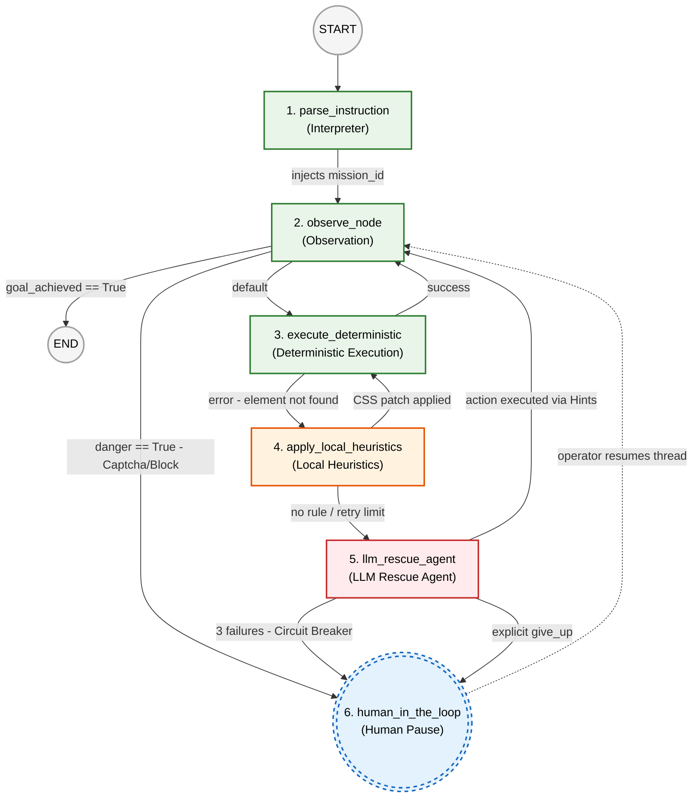
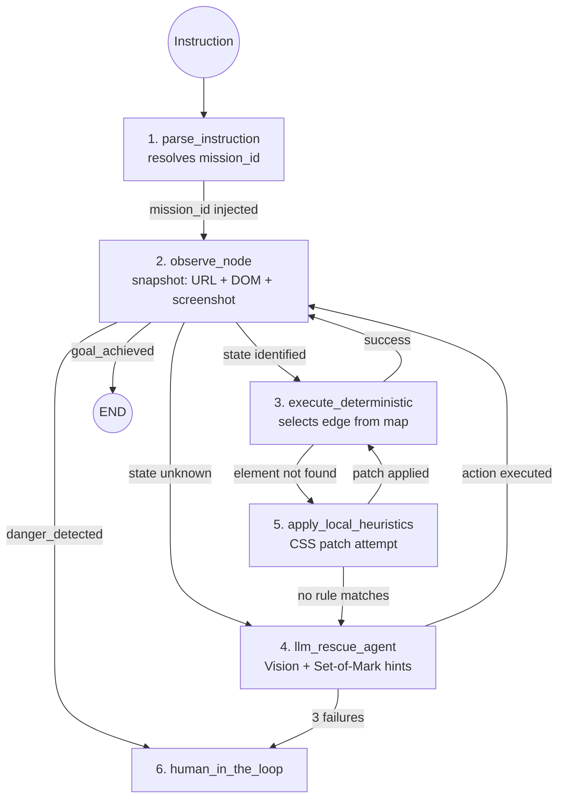

# Ariadne 2.0: Architecture & State Graph

## 1. Overview
Ariadne 2.0 is a **Programmable Semantic Browser** built on LangGraph. It functions as a **Just-In-Time (JIT) Flight Controller** that orchestrates browser navigation through a directed graph of states. It replaces the previous linear step-recorder model with a dynamic, state-aware navigation engine.

## 2. The Graph State (`AriadneState`)
The state is the immutable, serializable working memory that passes between nodes. It handles all working memory, profile data, and dynamic extractions.

```python
from typing import Annotated, TypedDict, Any
import operator
from langgraph.graph.message import AnyMessage, add_messages

class AriadneState(TypedDict):
    # Identity
    instruction: str        # natural language order from the user (resolved to mission_id by parse_instruction)
    job_id: str
    portal_name: str
    
    # Context (Static injection)
    profile_data: dict[str, Any]
    job_data: dict[str, Any]
    
    # Navigation Pointer
    path_id: str | None
    current_state_id: str
    
    # JIT Browser Snapshot
    dom_elements: list[dict]
    current_url: str
    screenshot_b64: str | None
    
    # session_memory: Read-write memory for extractions (e.g. Application IDs)
    session_memory: dict[str, Any]
    
    # Memory & Reducers
    errors: Annotated[list[str], operator.add]
    history: Annotated[list[AnyMessage], add_messages]
    
    # Active Strategy (Injected via URL context)
    portal_mode: str
```

## 3. Graph Topology (Cost-Optimized Cascade)

The core principle is **always try the cheapest path first**. Cost increases with each fallback level — the happy path spends $0 in tokens.



### Execution Paths

**Happy Path (Green loop) — cost: $0**
Portal hasn't changed. The graph enters through the interpreter, observes the screen, and enters a fast `Observe ↔ Exec` loop. The browser stays open in Crawl4AI — zero token spend, millisecond latency.

**Sad Path Level 1 (Orange loop) — cost: $0**
StepStone changes the "Apply" button class. `Exec` fails. The graph falls to `Heuristics`. The active mode finds a text-based variant (`"sofort-bewerben"`, `"Jetzt bewerben"`), patches the target in `patched_components`, clears the error, and returns to `Exec` for a retry. The user never sees it.

**Sad Path Level 2 (Red loop) — cost: ~$0.015 per rescue**
An unexpected cookie consent popup appears — not in the map. `Exec` fails. `Heuristics` has no rule for it. The graph falls to the LLM Agent. Set-of-Mark hints are injected (`[AA]`, `[AB]`), a screenshot is taken, and the LLM says: *"I see button [AB] labelled Accept. Calling click_hint('AB')."* Error clears, back to `Observe`.

**Controlled Surrender (Blue pause) — cost: human latency**
Cloudflare CAPTCHA detected. `Observe` reads the DOM text, raises `danger_detected`, and routes directly to HITL — skipping the entire cascade. The graph suspends, releasing CPU and RAM. The operator solves the CAPTCHA manually, runs `--resume --thread-id <id>`, and the graph wakes up at `Observe` exactly where it left off.

### Routing Functions (summary)
| From | Condition | To |
|---|---|---|
| `observe` | `goal_achieved` | `END` |
| `observe` | `danger_detected` | `human_in_the_loop` |
| `observe` | default | `execute_deterministic` |
| `execute_deterministic` | `errors` | `apply_local_heuristics` |
| `execute_deterministic` | success | `observe` |
| `apply_local_heuristics` | patched / retries < limit | `execute_deterministic` |
| `apply_local_heuristics` | errors or retry limit | `llm_rescue_agent` |
| `llm_rescue_agent` | success | `observe` |
| `llm_rescue_agent` | `agent_failures >= 3` or `give_up` | `human_in_the_loop` |

## 4. Common Language Models

### AriadneMap (Exploration Memory)
> **CRITICAL**: Maps are NOT hand-written JSON. They're built through exploration:
> 1. Crawl/Explore page → LLM traces action → HITL → Human guides → union of traces = map

```python
class AriadneMap(BaseModel):
    meta: AriadneMapMeta
    states: dict[str, AriadneStateDefinition] # Nodes (from traces)
    edges: list[AriadneEdge]                  # Transitions (from traces)
    success_states: list[str]
    failure_states: list[str]
```

### AriadneStateDefinition (Discovered Node)
```python
class AriadneStateDefinition(BaseModel):
    id: str
    description: str
    presence_predicate: AriadneObserve   # Logic to identify this node
    components: dict[str, AriadneTarget] # Named elements (from trace)
```

### AriadneEdge (Discovered Intent)
```python
class AriadneEdge(BaseModel):
    from_state: str
    to_state: str
    intent: AriadneIntent
    target: str | AriadneTarget
    value: str | None = None
    extract: dict[str, str] | None = None # key -> selector for blackboard write
```

## 5. End-to-End Chain of Actions

This section walks through how the graph processes a real instruction from CLI to completion.

**Example instruction:** `"busca pegas de Data Scientist en LinkedIn y postula"`



### Step-by-step

**1. `parse_instruction`**
Resolves the natural language instruction to a `mission_id`. For a compound instruction like "busca y postula", the interpreter sets the first mission (`discovery`) and stores `"next_mission": "easy_apply"` in `session_memory` for chaining.

**2. `observe_node` (runs every cycle)**
Takes a JIT snapshot of the browser. Two things happen here:
- **State identification**: compares DOM against the map's `presence_predicate` for each state. If matched, sets `current_state_id`.
- **Danger detection**: checks DOM text and URL against `ApplyDangerSignals`. CAPTCHA or security block → routes to HITL immediately.

**3. `execute_deterministic`**
Selects the eligible `AriadneEdge` for the current `(current_state_id, current_mission_id)` pair. Translates the edge intent to a motor command (C4A-Script or BrowserOS MCP) and fires the executor. Three special cases:

- **Easy Apply** (same-site form): follows the edge sequence through the modal, uploading CV from `session_memory["cv_path"]`.
- **External site** (off-portal form): edge is marked as an external transition. The executor navigates to the external URL; the map switches to a sub-map for that domain.
- **Email application** (`mailto:` detected): heuristics or the agent extract the email address into `session_memory["apply_email"]`; execution halts at HITL for the operator to send the email, or a future `send_email` capability handles it.

**4. `apply_local_heuristics`**
If an element isn't found (selector changed, A/B test, language variant), the active `AriadneMode` tries to patch the target. Example: searches for text variants like "sofort-bewerben", "Jetzt bewerben", "Apply now". If a match is found, it writes the patch to `patched_components` and retries `execute_deterministic`.

**5. `llm_rescue_agent`**
Last resort before HITL. Receives the screenshot with `[AA]`/`[AB]` Set-of-Mark hints injected and a minimal context dict. Uses BrowserOS MCP tools restricted to `click_hint(id)` and `fill_hint(id, value)`. Circuit breaker triggers after 3 failures → HITL.

**6. `human_in_the_loop`**
Graph suspends via LangGraph's native `interrupt_before`. State is persisted in SQLite checkpoint. Operator resumes with `--resume --thread-id <id>` and the graph continues from `observe`.

## 6. Persistence & Time-Travel
Using LangGraph's **Checkpointer**, every execution is versioned.
- ** thread_id = job_id**: Ensures continuity.
- **Architectural Undo**: If the LLM Agent mis-navigates, the system can revert the state to the last valid `Observe` node and pass control to the human.
