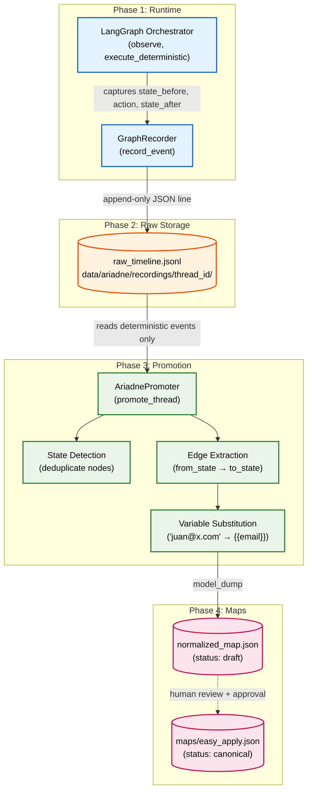

# Ariadne 2.0: Recording, Storage & Promotion

## Overview

The recording pipeline turns live browser sessions into reusable state graphs. We do not record linear macros — we record **state transitions** and promote them into a directed graph that can be evaluated against any mission.



## Phase 1: Runtime Recording (Passive)

While LangGraph navigates, the orchestrator silently calls `_record_graph_event` after each node. `GraphRecorder.record_event()` does an append to the session JSONL file. This is non-blocking and adds no latency to navigation.

Every event must carry a `source` tag so the promoter can filter correctly:

```json
{
  "event_type": "execute_deterministic",
  "thread_id": "abc123",
  "source": "deterministic",
  "payload": {
    "state_before": "job_details",
    "selected_edges": [...],
    "state_after": "modal_contact"
  }
}
```

Valid `source` values: `"deterministic"`, `"heuristic"`, `"llm_agent"`.

**Critical rule:** Only `"deterministic"` events become map edges. `"llm_agent"` events are stored as observations for human review but are never promoted to executable edges automatically.

## Phase 2: Raw Storage

Each session produces a JSONL file at `data/ariadne/recordings/<thread_id>/raw_timeline.jsonl`. One JSON object per line, append-only.

## Phase 3: Promotion (AriadnePromoter)

`AriadnePromoter.promote_thread(thread_id)` reads the JSONL and infers a state machine:

- **State deduplication**: if `job_details` appears 3 times across events, only one `AriadneStateDefinition` node is created.
- **Edge reconstruction**: each deterministic transition becomes an `AriadneEdge(from_state, to_state, intent, target)`.
- **Variable substitution (`_substitute_placeholders`)**: literal values filled during the session (e.g. `"juan@correo.com"`) are matched against `profile_data` and `job_data`. Matches are replaced with template tokens (e.g. `{{email}}`), making the map reusable across candidates.

The promoter outputs a Pydantic-validated `AriadneMap` with `status="draft"`.

## Phase 4: Promotion Lifecycle

Maps mature through three stages:

```
draft → verified → canonical
```

- **Draft**: newly promoted, not yet replayed. `MapRepository` must refuse to load drafts in production runs unless `--allow-draft` is explicitly passed.
- **Verified**: completed a successful dry-run replay by a deterministic executor.
- **Canonical**: operator-approved, stored in source control under `src/automation/portals/<portal>/maps/`, versioned (`v1`, `v2`).

## Storage Layout

### Packaged Maps (Source Control)
```
src/automation/portals/<portal>/maps/
  easy_apply.json   # canonical, versioned
  search.json
```

### Runtime Artifacts (Data Plane)
```
data/ariadne/recordings/<thread_id>/
  raw_timeline.jsonl    # append-only event log
  normalized_map.json   # draft map output from promoter
  screenshots/          # evidence per state (optional)
```

## Map Resolution

When a session starts, the orchestrator:
1. Loads the target `AriadneMap` via `MapRepository.get_map_async(portal_name)`.
2. Refuses to load `status="draft"` maps without an explicit override flag.
3. Enters at the defined `entry_state`.
4. Initializes `AriadneState` with the loaded map in scope.
