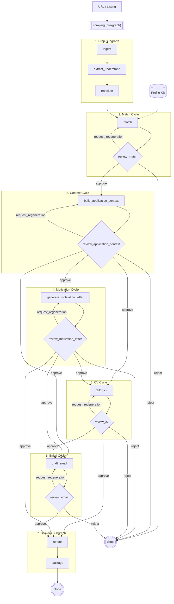

# Graph Definition and Node Summary (Canonical)

Related references:

- `docs/graph/node_io_matrix.md`
- `docs/philosophy/execution_taxonomy_abstract.md`
- `docs/business_rules/sync_json_md.md`
- `docs/architecture/core_io_and_provenance_manager.md`

## Purpose

This is the canonical graph document for runtime flow and node-level role summary.

It defines:

1. end-to-end routing order,
2. macro-subgraph composition,
3. review-branch semantics,
4. checkpoint and resume invariants,
5. per-node role summary.

## Authority scope

- Canonical owner for graph topology and routing semantics.
- Taxonomy definitions are owned by `docs/philosophy/execution_taxonomy_abstract.md`.
- Artifact path/schema contracts are owned by `docs/reference/artifact_schemas.md` and `docs/graph/node_io_matrix.md`.

## Canonical end-to-end flow

Primary sequence:

1. `scraping` (pre-graph)
2. `ingest`
3. `extract_understand`
4. `translate`
5. `match`
6. `review_match`
7. `build_application_context`
8. `review_application_context`
9. `generate_motivation_letter`
10. `review_motivation_letter`
11. `tailor_cv`
12. `review_cv`
13. `draft_email`
14. `review_email`
15. `render`
16. `package`

## Canonical macro-node composition

To keep top-level orchestration readable, the graph is grouped into subgraphs:

1. `prep_subgraph`: `ingest -> extract_understand -> translate`
2. `match_cycle_subgraph`: `match -> review_match` (+ regeneration loop)
3. `context_cycle_subgraph`: `build_application_context -> review_application_context` (+ regeneration loop)
4. `motivation_cycle_subgraph`: `generate_motivation_letter -> review_motivation_letter` (+ regeneration loop)
5. `cv_cycle_subgraph`: `tailor_cv -> review_cv` (+ regeneration loop)
6. `email_cycle_subgraph`: `draft_email -> review_email` (+ regeneration loop)
7. `delivery_subgraph`: `render -> package`

Top-level expression:

`scraping -> prep_subgraph -> match_cycle_subgraph -> context_cycle_subgraph -> motivation_cycle_subgraph -> cv_cycle_subgraph -> email_cycle_subgraph -> delivery_subgraph`

## Review-branch semantics

For every review node (`review_match`, `review_application_context`, `review_motivation_letter`, `review_cv`, `review_email`):

- `approve` -> continue to next phase.
- `request_regeneration` -> loop to the paired generation node.
- `reject` -> terminate current run.

Routing decisions must be explicit and persisted in run metadata.

## Checkpoints and resume invariants

Resume is allowed only at review interrupts.

Mandatory invariants before resume:

1. `run_id` matches checkpoint context,
2. pending review gate matches current graph status,
3. decision artifact validates against the active proposed-state hash,
4. decision parse is deterministic and unambiguous.

If any invariant fails, resume must stop with an actionable error.

## Node role summary

This section summarizes role and execution class. Detailed I/O contracts live in `docs/graph/node_io_matrix.md`.

### Pre-graph and preparation

- `scraping` (`NLLM-ND`): fetches/crawls source pages and writes raw artifacts.
- `ingest` (`NLLM-D`): normalizes source artifacts into canonical ingest state.
- `extract_understand` (`NLLM-D`): produces structured job understanding.
- `translate` (`NLLM-ND`): normalizes language using bounded external translation behavior.

### Matching and context

- `match` (`LLM`): maps requirements to evidence and proposes claims for review.
- `review_match` (`NLLM-D`): deterministic parser gate for matching decisions.
- `build_application_context` (`LLM`): composes approved strategy/context for downstream generation.
- `review_application_context` (`NLLM-D`): deterministic parser gate for context decisions.

### Generation and delivery

- `generate_motivation_letter` (`LLM`): drafts motivation letter proposal.
- `review_motivation_letter` (`NLLM-D`): deterministic parser gate for letter decisions.
- `tailor_cv` (`LLM`): drafts CV proposal.
- `review_cv` (`NLLM-D`): deterministic parser gate for CV decisions.
- `draft_email` (`LLM`): drafts application email proposal.
- `review_email` (`NLLM-D`): deterministic parser gate for email decisions.
- `render` (`NLLM-D`): deterministic render of approved artifacts.
- `package` (`NLLM-D`): produces final bundle and manifest.

## Mermaid view

## Non-negotiable graph invariants

1. Downstream nodes read approved artifacts only.
2. Review parsers fail closed on malformed or stale decisions.
3. No success path may rely on placeholder fallback payloads.
4. Approved critical-path artifacts carry provenance metadata.
