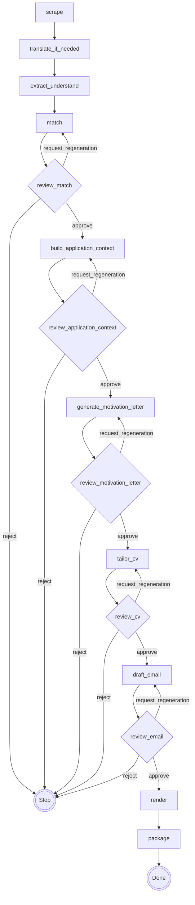

# Graph Flow and Node Summary

Related references:

- `src/graph.py`
- `src/cli/run_prep_match.py`
- `docs/graph/node_io_matrix.md`
- `docs/reference/data_management_actual_state.md`
- `docs/architecture/core_io_and_provenance_manager.md`

## Purpose

This document separates:

1. **Current implemented graph behavior** (what runs now), and
2. **Target full-graph contract** (where architecture is headed).

The split exists to keep day-to-day operation aligned with the real codebase while preserving the long-term design contract.

## Authority scope

- Canonical owner for topology and routing semantics at graph level.
- Node-level path/schema detail is owned by `docs/graph/node_io_matrix.md` and `docs/reference/artifact_schemas.md`.

## A) Current implemented runtime graph (actual codebase)

### Executable entrypoints

- Primary runtime path is the prep-match app built by `create_prep_match_app()` in `src/graph.py`.
- Operator entrypoint is `python -m src.cli.run_prep_match` (`src/cli/run_prep_match.py`).

### Current flow and branching

Linear path:

1. `scrape`
2. `translate_if_needed`
3. `extract_understand`
4. `match`
5. `review_match`

Current review routing (`review_match`):

- `approve` -> `package` (prep terminal node)
- `request_regeneration` -> `match`
- `reject` -> end

`package` in this prep graph is a terminal state-update node, not the final delivery packager from the full target architecture.

### Checkpoint and resume behavior (current)

- `thread_id` is `f"{source}_{job_id}"`.
- CLI stores checkpoints in `data/jobs/<source>/<job_id>/graph/checkpoint.sqlite` by default.
- Resume invokes graph with `payload=None` and checkpoint config; execution restarts from checkpointed review context.
- `review_match` enforces deterministic decision parsing and stale-hash protection for reviewed match state.

### Current node role summary

- `scrape` (`NLLM-ND`): fetches URL and builds ingested payload in state.
- `translate_if_needed` (`NLLM-ND`): conditionally normalizes text language in state.
- `extract_understand` (`LLM`): extracts structured job understanding into state.
- `match` (`LLM`): generates requirement-evidence matching and persists round-based review artifacts.
- `review_match` (`NLLM-D`): parses review markdown, validates routing decision, writes decision/feedback artifacts.
- `package` (`NLLM-D`, prep terminal): marks run completed for this subgraph.

### Implemented-but-not-wired note

- `src/nodes/generate_documents/` is implemented and tested, with deterministic assist artifacts.
- It is not currently part of `build_prep_match_node_registry()`.

### Mermaid (current runtime)

```mermaid
flowchart TD
    Scrape[scrape] --> Translate[translate_if_needed]
    Translate --> Extract[extract_understand]
    Extract --> Match[match]
    Match --> ReviewMatch{review_match}

    ReviewMatch -- request_regeneration --> Match
    ReviewMatch -- approve --> PrepPackage[package (prep terminal)]
    ReviewMatch -- reject --> Stop(((Stop)))

    PrepPackage --> Done(((Done)))
```

## B) Target full-graph contract (architectural)

This section describes the intended end-to-end graph contract used by architecture docs.

### Target end-to-end flow

1. `scrape`
2. `translate_if_needed`
3. `extract_understand`
4. `match`
5. `review_match`
6. `build_application_context`
7. `review_application_context`
8. `generate_motivation_letter`
9. `review_motivation_letter`
10. `tailor_cv`
11. `review_cv`
12. `draft_email`
13. `review_email`
14. `render`
15. `package`

### Target macro-subgraph composition

1. `prep_subgraph`: `scrape -> translate_if_needed -> extract_understand`
2. `match_cycle_subgraph`: `match -> review_match` (+ regeneration loop)
3. `context_cycle_subgraph`: `build_application_context -> review_application_context` (+ regeneration loop)
4. `motivation_cycle_subgraph`: `generate_motivation_letter -> review_motivation_letter` (+ regeneration loop)
5. `cv_cycle_subgraph`: `tailor_cv -> review_cv` (+ regeneration loop)
6. `email_cycle_subgraph`: `draft_email -> review_email` (+ regeneration loop)
7. `delivery_subgraph`: `render -> package`

Top-level expression:

`prep_subgraph -> match_cycle_subgraph -> context_cycle_subgraph -> motivation_cycle_subgraph -> cv_cycle_subgraph -> email_cycle_subgraph -> delivery_subgraph`

### Target review-branch semantics

For every review node (`review_match`, `review_application_context`, `review_motivation_letter`, `review_cv`, `review_email`):

- `approve` -> continue to next phase
- `request_regeneration` -> loop to paired generator
- `reject` -> terminate run

Routing decisions must be explicit and persisted in review artifacts.

### Target checkpoint and resume invariants

1. `run_id` matches checkpoint context.
2. Pending review gate matches graph status.
3. Decision artifact hash matches active proposed-state payload.
4. Decision parse is deterministic and unambiguous.

If any invariant fails, resume must stop with actionable error.

### Target node role summary

- `scrape` (`NLLM-ND`): fetches and normalizes source artifacts.
- `translate_if_needed` (`NLLM-ND`): language normalization.
- `extract_understand` (`LLM`): structured job understanding.
- `match` (`LLM`): requirement-evidence matching proposal.
- `review_match` (`NLLM-D`): deterministic match review gate.
- `build_application_context` (`LLM`): downstream generation strategy context.
- `review_application_context` (`NLLM-D`): deterministic context review gate.
- `generate_motivation_letter` (`LLM`): motivation letter draft generation.
- `review_motivation_letter` (`NLLM-D`): deterministic letter review gate.
- `tailor_cv` (`LLM`): CV tailoring generation.
- `review_cv` (`NLLM-D`): deterministic CV review gate.
- `draft_email` (`LLM`): email draft generation.
- `review_email` (`NLLM-D`): deterministic email review gate.
- `render` (`NLLM-D`): deterministic render step.
- `package` (`NLLM-D`): final packaging and manifest.

### Mermaid (target architecture)



## Non-negotiable graph invariants

### Current implemented path

1. `match`/`review_match` fail closed on malformed review and regeneration inputs.
2. Resume is gated by deterministic review parsing and source hash checks when present.
3. No silent success fallback is allowed on invalid review state.

### Target full path

1. Downstream nodes read approved artifacts only.
2. Review parsers fail closed on malformed or stale decisions.
3. No success path may rely on placeholder fallback payloads.
4. Approved critical-path artifacts carry provenance metadata.
