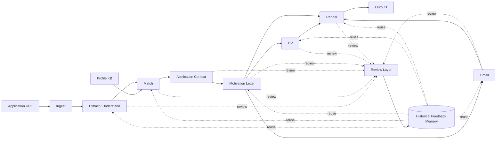

PhD / Job Application Agent — Main Diagram
==========================================

This diagram models the system as a human-supervised application alignment pipeline
with reusable historical feedback across all stages.

Mermaid
-------

Interpretation
--------------

1. Ingest
   - Receives the application URL.
   - Scrapes and normalizes the source posting.

2. Extract / Understand
   - Extracts requirements, keywords, soft signals, and posting metadata.
   - Produces a structured understanding of the opportunity.

3. Match
   - Compares the posting against the user's profile knowledge base.
   - Produces a strategic proposal of strengths, gaps, and emphasis areas.

4. Application Context
   - Represents the validated, case-specific positioning to be used downstream.
   - This is the grounded context for all later generation steps.

5. Motivation Letter
   - Generates the tailored motivation / cover letter.

6. CV
   - Generates a tailored CV based on the validated application context and reviewed letter direction.

7. Email
   - Drafts the application email aligned with the same positioning.

8. Render
   - Produces final renderable artifacts (PDFs or equivalent final assets).

9. Outputs
   - Final deliverables for the application.

Cross-cutting design principle
------------------------------

Every main stage is reviewable.
Human review does not only correct the current artifact:
- it improves the current case
- it also writes reusable historical feedback

Historical Feedback Memory should inform future runs at:
- extraction / understanding
- matching
- motivation writing
- CV tailoring
- email drafting
- rendering decisions

Recommended architectural framing
---------------------------------

This is not just a document generator.

A more accurate framing is:

"Human-supervised application alignment system with reusable editorial memory."

Suggested high-level layers
---------------------------

1. Input layer
   - URL
   - Profile knowledge base

2. Interpretation layer
   - ingest
   - extraction
   - matching

3. Alignment layer
   - review
   - feedback application
   - historical memory

4. Generation layer
   - motivation letter
   - CV
   - email

5. Delivery layer
   - render
   - outputs
