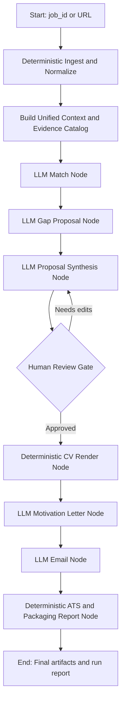

# Unified Flow Graph

Date: 2026-03-02

## 1) Mermaid Graph

## 2) Phase Table

| Phase | Node Type | Input | Output | Retry Policy |
|---|---|---|---|---|
| ingest | deterministic | url/job_id | normalized job artifacts | fail-fast |
| context | deterministic | job + profile | unified context payload | fail-fast |
| match | llm-template | context | requirement mapping | retry/transient |
| gap | llm-template | mapping + evidence | gap proposals | retry/transient |
| proposal | llm-template | mapping + gaps | approved/proposed claims | retry/transient |
| review_gate | human | proposal artifacts | approved/blocked flag | n/a |
| render_cv | deterministic | approved claims | CV md/docx/pdf artifacts | fail-fast |
| motivation | llm-template | approved claims + job | letter artifact | retry/transient |
| email | llm-template | job + candidate + letter meta | email artifact | retry/transient |
| report | deterministic | all artifacts | run report + ATS report | fail-fast |

## 3) State Transition Rules

1. Every node writes a checkpoint snapshot.
2. `review_gate` is the only blocking gate by design.
3. Resume starts from first non-completed node.
4. LLM quota or parse failures mark node `failed` with normalized error payload.

## 4) Failure Paths

- `LLMRateLimitError`: pause and resume later without rerunning completed deterministic nodes.
- `LLMParseError`: bounded retry, then fail with raw-response hash recorded.
- Deterministic render failure: fail run immediately with actionable artifact path.
