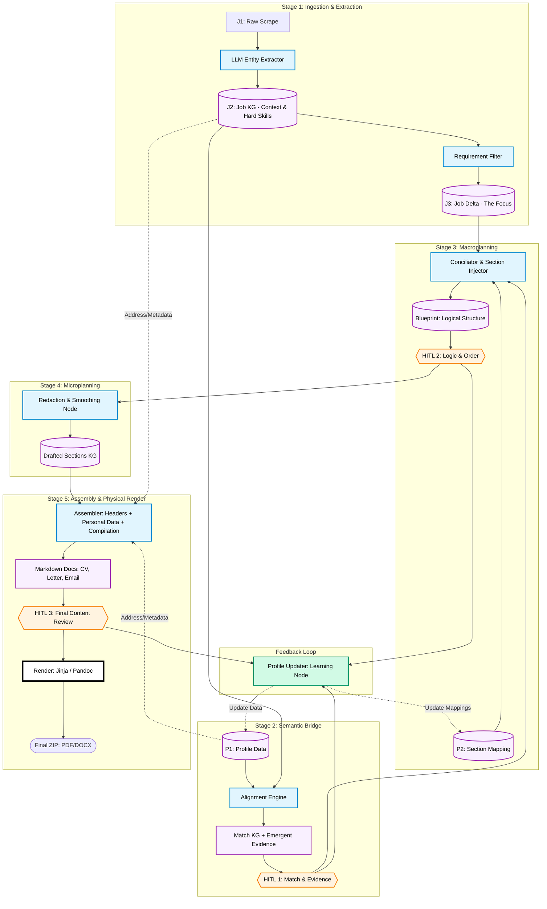

---

# Especificación Técnica: Pipeline de Conciliación Estructural Pro

## 1. Definición de Procesos HITL (Human-In-The-Loop)
Las correcciones en estos puntos son **bidireccionales**: ajustan el flujo actual y se guardan como "aprendizaje" para actualizar el Perfil ($P_1, P_2$) en ejecuciones futuras.

* **HITL 1 (Match & Emergent Evidence):** * **Acción:** Aprueba/rechaza matches técnicos.
    * **Inyección:** Permite introducir "evidencia emergente" que no estaba en el KG (ej: "olvidé poner que estuve en el equipo de debate" o "soy fan de Spotify"). Esto crea nodos temporales en el Match KG.
* **HITL 2 (Blueprint Logic):** * **Acción:** Auditoría del "Tren de Frases".
    * **Inyección:** Reordena, quita ideas redundantes o introduce puntos clave que el mapeo automático omitió. Aquí se valida la *estrategia* antes de redactar.
* **HITL 3 (Content & Style):** * **Acción:** Revisión sobre el Markdown final.
    * **Feedback:** "Suena muy arrogante", "Cambia esta idea por esta otra". Es la validación de la **narrativa final**.

---


## 3. Desglose de Etapas Críticas

### Etapa 2: El Vínculo con $P_2$ y $J_3$ (El Artefacto Blueprint)
Aquí es donde ocurre la conciliación real. 
* Tomamos el **$P_2$ (Section Mapping)** que nos dice qué suele ir en cada sección.
* Inyectamos el **$J_3$ (Job Delta)** y la evidencia de **HITL 1**.
* **Resultado:** El **Blueprint**. No es un documento, es una estructura de "intentos" ordenada. Es el esqueleto que dice: "En el párrafo 2 de la carta, primero mencionamos el proyecto de trenes y luego cómo eso resuelve el requerimiento de Rust de la empresa".

### Etapa 4: Document Assembly (Ensamblado Lógico)
Este es el nodo que mencionabas. Aquí pasamos de "colección de secciones redactadas" a **3 documentos Markdown**.
1.  **Context Injection:** Se toman los datos de contacto del usuario ($P_1$) y de la empresa ($J_2$). 
2.  **Header/Footer Logic:** Se genera la Kopfzeile (encabezado), la dirección del remitente/destinatario y la fecha.
3.  **Compilation:** Se pegan las secciones redactadas en Stage 3 siguiendo la plantilla del documento.
4.  **Output:** 3 archivos Markdown completos y legibles.

### Etapa 5: Physical Rendering (Proceso de Salida)
Este nodo es **puramente técnico**.
* Toma el Markdown aprobado en HITL 3.
* Lo pasa por el motor de plantillas (Jinja2) para ajustar variables de estilo (fuentes, márgenes).
* Pandoc genera el binario (PDF o DOCX). 
* **Nota:** Si el usuario quiere un cambio visual (ej. "usar otra fuente"), el feedback de HITL 3 puede disparar un re-renderizado aquí sin tocar la lógica de las etapas anteriores.

---

## 4. Persistencia del Feedback
Cualquier cambio manual en HITL 1, 2 o 3 (ej. una frase que el usuario redactó mejor) se envía a un nodo de **"Profile Updater"** (fuera del camino crítico del render) para que la próxima vez que se genere un documento para un puesto similar, el sistema ya cuente con esa "evidencia" o "estilo" mejorado en $P_1$ o $P_2$.

¿Este desglose de los HITL y la separación del Assembler vs Render captura finalmente la profundidad de tu arquitectura?


¡Totalmente! Si ya tenemos claro el "corazón" del proceso (la conciliación estructural), el resto de las etapas deben ser igual de robustas para que el sistema no se caiga en los detalles.

Aquí te completo el mapa de las etapas "periféricas" (Ingestión y Post-Procesamiento), que son las que aseguran que la materia prima sea de calidad y que el producto final no parezca un Frankenstein de retazos.

---

## 1. Stage 1: El Refinado de la Materia Prima (De $J_1$ a $J_3$)

Para que el Matcher no alucine, el Job debe pasar por una purificación estricta.

* **$J_1 \rightarrow J_2$ (Extracción de Entidades):** No es solo resumir. Es un proceso de "vaciado" donde el LLM identifica:
    * **Hard Requirements:** Skills técnicos, años, certificaciones.
    * **Soft Context:** Cultura (¿son competitivos o colaborativos?), beneficios (¿hay relocalización?), y el "Vibe" del equipo.
    * **Logística:** Ubicación, modalidad, tipo de contrato.
* **$J_2 \rightarrow J_3$ (El Delta de Requerimientos):** Aquí el sistema decide qué es lo **ignorable** y qué es lo **crítico**. 
    * Si el Job pide "Python" y "ganas de aprender", el $J_3$ prioriza el Python pero anota que en la sección de "Metas" del perfil ($P_1$) hay que buscar algo que haga match con el aprendizaje continuo.

---

## 2. Stage 4: Microplanning y el "Alisamiento" (Smoothing)

Una vez que el **Blueprint** (Stage 3) está aprobado en el **HITL 2**, pasamos a "picar piedra" con el texto.

* **Redaction (The Drafting Node):** Aquí el LLM recibe una sección del Blueprint (ej: "Proyecto de Trenes") y la orden de estilo de $P_2$. 
    * *Input:* `[Idea: Trenes] + [Skill: Rust] + [Context: Deutsche Bahn] + [Style: Persuasive]`.
    * *Output:* Un párrafo crudo pero gramaticalmente correcto.
* **Smoothing (Coherencia Transversal):** Este es el paso que evita el "Copy-Paste". El nodo lee el documento completo en Markdown y ajusta los conectores:
    * Si el párrafo A termina hablando de una tecnología, el párrafo B debe empezar con un "Siguiendo con mi experiencia técnica..." o similar. **Es un editor de estilo, no un generador de contenido.**

---

## 3. El Nodo "Invisible": Profile Updater (El Feedback Loop)

Este nodo corre en paralelo o al final de cada **HITL**. Su función es la **Evolución del Perfil**.

* **Aprendizaje de Evidencia:** Si en el **HITL 1** agregaste: *"Trabajé en un proyecto de música en 2019"*, el Updater lo guarda en $P_1$ para que esté disponible en la próxima postulación.
* **Aprendizaje de Mapeo:** Si en el **HITL 2** moviste una sección de "Hobbies" al final porque en Alemania se estila así, el Updater ajusta el $P_2$ (Section Mapping) para que la próxima vez el Blueprint ya venga ordenado de esa forma por defecto.
* **Aprendizaje de Estilo:** Si en el **HITL 3** cambiaste "Soy experto" por "Cuento con amplia trayectoria", el sistema detecta esa preferencia tonal y la guarda en el perfil para futuras redacciones.

---

## 4. Grafo de Especificación Final (Obsidian Ready)

He incluido el flujo de **Profile Update** y la separación clara de **Assembly vs Render**.



---

### Detalles Finales del "Assembler"
El nodo **Assembler** (Stage 5) es el que "empaqueta" todo. Es el que sabe que para la carta de motivación alemana (Anschreiben), los datos de la empresa ($J_2$) van en la esquina superior izquierda, seguidos de la fecha y el asunto. Este nodo es **lógico-estructural** pero todavía trabaja en Markdown, lo que permite que el **HITL 3** sea una revisión de un documento que ya "se siente" real.

Con esto, el pipeline cubre desde la curiosidad por Spotify hasta el PDF final en tu carpeta de descargas.

¿Crees que con esta profundidad el "Profile Updater" es suficiente para capturar las correcciones manuales, o te gustaría que ese feedback tuviera una etapa de validación extra?


Para que este flujo sea **robusto y auditable**, necesitamos un ecosistema de modelos Pydantic que actúen como contratos estrictos entre los nodos de LangGraph. Aquí tienes el resumen de los modelos, organizados por la fase del pipeline en la que cobran protagonismo.

---

## 1. Modelos de Base y Trazabilidad (Cross-Cutting)
Estos modelos aseguran que siempre sepamos de dónde viene cada palabra.

* **`TextAnchor`**: Define una ubicación exacta en el documento original ($J_1$ o $P_3$).
    * Campos: `document_id`, `start_index`, `end_index`, `exact_quote`.
* **`IdeaFact`**: La unidad mínima de información "conciliada".
    * Campos: `id`, `provenance_refs` (IDs de $P_1$ o $J_2$), `core_content` (el dato), `priority` (1-5), `status` (`keep`, `hide`, `merge`).

---

## 2. Modelos de Estado de Entrada ($P_n$ y $J_n$)

### Perfil (Persistente)
* **`ProfileKG` ($P_1$)**: El grafo de conocimiento del candidato.
    * Campos: `entries` (experiencias), `skills` (normalizadas), `traits` (hobbies/metas), `evidence_edges`.
* **`SectionMapping` ($P_2$)**: La estrategia de distribución de datos.
    * Campos: `section_id`, `default_fact_ids` (qué datos del KG suelen ir aquí), `target_tone`.

### Job (Efímero)
* **`JobKG` ($J_2$)**: El vaciado profundo de la oferta.
    * Campos: `hard_requirements`, `soft_context` (cultura/vibe), `logistics` (visa/relocation), `source_anchors`.
* **`JobDelta` ($J_3$)**: El filtro de relevancia para la postulación actual.
    * Campos: `must_highlight_ids`, `ignored_requirements`, `custom_instructions`.

---

## 3. Modelos de Inteligencia (Matching & Blueprint)

* **`MatchEdge`**: El puente semántico.
    * Campos: `requirement_id`, `profile_evidence_ids`, `match_score`, `reasoning` (por qué encajan).
* **`SectionBlueprint`**: El "Tren de Frases" antes de redactar.
    * Campos: `section_id`, `logical_train_of_thought` (lista ordenada de `IdeaFact`), `section_intent` (qué queremos lograr con este párrafo).
* **`GlobalBlueprint`**: El mapa total del "Mega-Documento".
    * Campos: `application_id`, `abstract_sections` (lista de `SectionBlueprint`).

---

## 4. Modelos de Redacción y Ensamblado

* **`DraftedSection`**: El resultado del Microplanning.
    * Campos: `section_id`, `raw_markdown`, `is_cohesive` (flag de smoothing), `word_count`.
* **`MarkdownDocument`**: Un documento completo listo para el Assembler.
    * Campos: `doc_type` (CV/Letter/Email), `header_data` (metadatos inyectados), `body_markdown`, `footer_data`.
* **`FinalMarkdownBundle`**: El artefacto que recibe el HITL 3.
    * Campos: `cv_md`, `letter_md`, `email_md`, `metadata_summary`.

---

## 5. Modelo de Intervención Humana (Universal HITL)

* **`GraphPatch`**: El modelo único para corregir cualquier etapa.
    * Campos:
        * `action`: `approve`, `reject`, `modify`, `request_regeneration`, `move_to_document`.
        * `target_type`: `node`, `edge`, `section`, `fact`, `layout`.
        * `target_id`: El ID del elemento a parchear.
        * `new_value`: El valor corregido (si aplica).
        * `feedback_note`: Nota para el LLM (especialmente en `request_regeneration`).
        * `persist_to_profile`: Booleano para activar el **Profile Updater**.

---

### Resumen del Flujo de Datos
1.  **Ingestion**: $J_1 \rightarrow$ `JobKG` ($J_2$).
2.  **Matching**: `ProfileKG` + `JobKG` $\rightarrow$ `MatchEdge` [HITL 1].
3.  **Macroplanning**: `SectionMapping` + `JobDelta` + `MatchEdge` $\rightarrow$ `GlobalBlueprint` [HITL 2].
4.  **Microplanning**: `GlobalBlueprint` $\rightarrow$ `DraftedSection` $\rightarrow$ `MarkdownDocument`.
5.  **Assembly**: `MarkdownDocument` + `ContactInfo` $\rightarrow$ `FinalMarkdownBundle` [HITL 3].
6.  **Physical Render**: `FinalMarkdownBundle` $\rightarrow$ PDF/DOCX.

Este ecosistema asegura que el **Profile Updater** pueda leer cualquier `GraphPatch` que tenga `persist_to_profile=True` y sepa exactamente qué ID de $P_1$ o $P_2$ debe modificar.

¿Te falta algún campo o relación específica que creas que debamos "apretar" más?

Entendido. Vamos a la médula técnica. Para que LangChain y LangGraph operen este sistema con precisión, los esquemas deben ser exhaustivos. Cada campo incluye su `Field(description=...)` para guiar al LLM en el proceso de extracción y razonamiento.

Para que el **Assembler** no cometa errores en el riguroso estándar alemán (**DIN 5008**), necesitamos definir esquemas que no solo digan qué información va, sino **dónde y con qué etiqueta legal**. Alemania no perdona un error de formato en una _Anschreiben_ o un _Lebenslauf_.


Sí, es **ahora mismo**. Si no definimos estas plantillas de secciones (el esqueleto del $P_2$), el **Conciliador** no sabrá qué buscar en tu "bolsa de ideas" ($Fact Pool$). No es lo mismo destacar que usas Kafka para una empresa de logística que para un laboratorio de investigación de sistemas distribuidos.

Aquí tienes la matriz de secciones por tipo de documento. Esto es lo que el **Assembler** usará como "mapa de ruta" para construir el **Blueprint**.

---

## 1. Matriz de Secciones: Curriculums (CV)

|**Sección**|**CV Profesional (CL/DE)**|**CV Académico (Investigación)**|
|---|---|---|
|**Header**|Datos contacto + Residencia + Visa.|Datos contacto + Afiliación Institucional.|
|**Summary**|Perfil de valor (logros y años exp).|**Research Interests** (líneas de investigación).|
|**Experience**|Cargos, contextos y **Logros cuantificados**.|**Research Experience** (proyectos, labs, estancias).|
|**Education**|Títulos y Universidad (lo último primero).|Títulos + **Tesis** (título y tutor).|
|**Publications**|Opcional/Oculto (salvo si es muy relevante).|**Obligatorio** (Journals, conferencias, libros).|
|**Teaching**|Opcional (solo si aplica).|**Obligatorio** (Cursos dictados, ayudantías).|
|**Grants/Awards**|Premios de empresa o becas.|Becas de investigación, fondos (ANID, DAAD, etc).|
|**Skills**|Stack tecnológico y herramientas.|Metodologías, técnicas de lab, software científico.|
|**References**|Nombres y cargos (en Chile).|**Panel de Referencias** (3-4 profesores con contacto).|

---

## 2. Matriz de Secciones: Cartas de Motivación

La diferencia aquí es el **"Argumento Central"**. En la profesional es "qué te aporto hoy"; en la académica es "cómo mi visión expande tu línea de investigación".

### A. Carta Profesional (Chile/Alemania)

1. **Contexto:** Por qué esta empresa y este cargo.
    
2. **Match Técnico:** Cómo mi experiencia resolvió problemas similares a los del Job.
    
3. **Soft Fit:** Cultura, valores y logística (visa/relocalización).
    
4. **Cierre:** Disponibilidad y CTA.
    

### B. Carta Académica (Maestría/Doctorado/Postdoc)

1. **Propósito:** El programa o fondo específico al que postulas.
    
2. **Background Académico:** Hitos de tu formación y por qué te prepararon para este nivel.
    
3. **Investigación Actual:** De qué trata tu trabajo hoy y qué brecha de conocimiento atacas.
    
4. **Alineación con el Supervisor:** Por qué quieres trabajar con el Profesor X o en el Laboratorio Y (esto es **crítico**).
    
5. **Visión a Futuro:** Cómo este programa te ayuda a tu meta de 5-10 años en la academia.
    

---

## 3. ¿Cómo lo maneja el Sistema? (La lógica $P_2$)

El **Conciliador** usará un "Selector de Estrategia" en el Stage 3. Dependiendo de los metadatos del Job ($J_2$), activará uno de estos perfiles de sección:

### Escenario A: Postulación a Senior Data Engineer (Deutsche Bahn)

- **Estrategia:** `Professional_German`.
    
- **Acción:** Activa `Photo`, `Signature`, `Visa_Status`. Prioriza `Experience_Logros` en el CV. En la carta, prioriza `Technical_Match`.
    

### Escenario B: Postulación a PhD en Computer Science (TU Munich)

- **Estrategia:** `Academic_German`.
    
- **Acción:** Activa `Publications`, `Research_Projects`, `Teaching`. En la carta, busca en tu $P_1$ (Traits) tu "Tesis de Pregrado" y la conecta con los papers del profesor que extrajo en $J_2$.
    

---

## 4. El "Mega-Filtro" de Hechos ($IdeaFacts$)

Esto es lo más profundo: **un mismo hecho cambia de forma según el documento.**

- **Hecho en $P_1$:** "Diseñé un algoritmo de optimización de rutas en Rust".
    
- **En CV Profesional:** "Optimicé rutas reduciendo costos en 15%". (Foco: Eficiencia).
    
- **En CV Académico:** "Desarrollé un modelo heurístico basado en grafos para el problema X". (Foco: Metodología).
    
- **En Carta Académica:** "Mi interés en la optimización combinatoria nació diseñando algoritmos de rutas...". (Foco: Trayectoria intelectual).
    

### ¿Estamos claros con las secciones?

Si estas listas te hacen sentido, ya podemos definir los **Pydantics** sabiendo que el objeto `Section` tendrá un campo `type` que le dirá al **Conciliador** qué "máscara" ponerle a los datos.

**¿Quieres que definamos ahora el esquema Pydantic del `GlobalBlueprint` que orquestará todas estas secciones?** Es el que dirá: "Para este proceso, usa estas 8 secciones de la lista Académica".


Aquí tienes la definición técnica de los esquemas que gobernarían el caso alemán en tu sistema.

---

## 1. Esquema de la Carta de Motivación Alemana (Anschreiben)

La carta alemana es, ante todo, un documento formal de negocios. El esquema debe asegurar la posición de los bloques para que coincidan con los sobres de ventana europeos (C4).

### El Modelo de Secciones ($P_2$):

- **`Absender` (Remitente):** Datos de $P_1$ (Nombre, dirección, teléfono, email).
    
- **`Empfängerbezeichnung` (Destinatario):** Datos de $J_2$ (Empresa, Nombre del contacto, dirección completa).
    
- **`Ort_Datum` (Lugar y Fecha):** Ej: "Berlin, den 31. März 2026".
    
- **`Betreffzeile` (Asunto):** **Negrita obligatoria**. `Bewerbung als [Job_Title] (- Ref. Nr. [ID])`.
    
- **`Anrede` (Saludo):** Si $J_2$ tiene nombre: `Sehr geehrte/r Frau/Herr [Name]`. Si no: `Sehr geehrte Damen und Herren`.
    
- **`Einleitung` (Introducción):** El "Hook". Por qué esta empresa y por qué ahora.
    
- **`Hauptteil_1` (Why Me?):** Match técnico ($J_3$ + $P_1$ Evidence).
    
- **`Hauptteil_2` (Why You?):** Afinidad cultural y metas ($P_1$ Traits + $J_2$ Vibe).
    
- **`Schlusssatz` (Cierre):** Disponibilidad, pretensión salarial (si se pide) y mención a la entrevista.
    
- **`Grussformel` (Despedida):** Estándar: `Mit freundlichen Grüßen`.
    
- **`Anlagenverzeichnis` (Anexos):** `Anlagen: Lebenslauf, Zeugnisse`.
    

---

## 2. Esquema del CV Alemán (Lebenslauf)

El CV alemán es sobrio, funcional y **tabulado**. Se prefiere una estructura de dos columnas o una lista muy clara con fechas a la izquierda (`MM/YYYY – MM/YYYY`).

### El Modelo de Secciones ($P_2$):

- **`Persönliche_Daten` (Datos Personales):** * Obligatorio: Foto (Bewerbungsfoto), Fecha de nacimiento, Nacionalidad.
    
    - Opcional: Estado civil (Familienstand).
        
- **`Beruflicher_Werdegang` (Experiencia):** Orden cronológico inverso.
    
    - Slots: `Zeitraum`, `Position`, `Arbeitgeber`, `Kernaufgaben` (Tareas) y `Erfolge` (Logros).
        
- **`Ausbildung` (Educación):** Incluye desde la universidad hasta el colegio (Abitur), especialmente si eres junior.
    
- **`Kenntnisse_Sprachen` (Skills e Idiomas):** Clasificación europea (A1-C2) para idiomas.
    
- **`Sonstiges` (Otros):** Intereses, Hobbies (solo si aportan al match, como tus trenes) y voluntariados.
    
- **`Unterschrift` (Firma):** Lugar, fecha y firma escaneada o manual.
    

---

## 3. Definición en Pydantic: `GermanDocumentSchema`

Este sería el contrato que el **Assembler** lee para saber cómo organizar el **Blueprint**.

Python

```
from pydantic import BaseModel, Field
from typing import List, Optional, Literal

class GermanSection(BaseModel):
    id: str
    label: str  # El nombre que aparecerá en el PDF (ej: "Beruflicher Werdegang")
    is_mandatory: bool = True
    render_style: Literal["block", "table", "header", "signature"]
    
    # El mapeo lógico: qué tipos de hechos de P1/J3 puede aceptar
    allowed_fact_categories: List[str] 

class GermanDocumentDefinition(BaseModel):
    doc_type: Literal["cv", "letter"]
    standard: Literal["DIN_5008"] = "DIN_5008"
    language: Literal["de"] = "de"
    
    # La secuencia estricta de secciones
    layout_sequence: List[GermanSection]
    
    # Reglas específicas de Alemania
    require_photo: bool = True
    require_signature: bool = True
    date_format: str = "DD.MM.YYYY"
```

---

## 4. El "Vaciado" del Blueprint para Alemania

Cuando el **Conciliador** arma el Blueprint para estos esquemas:

1. **En el CV:** El Conciliador ve que el `GermanSection(id="experience")` tiene `render_style="table"`. Entonces, organiza los `IdeaFacts` en pares: `[Fecha] | [Hecho]`.
    
2. **En la Carta:** El Conciliador ve que el `GermanSection(id="subject")` es obligatorio. Si el $J_2$ no tiene un ID de referencia, el Conciliador levanta una alerta o usa un fallback: `Bewerbung als [Job_Title]`.
    
3. **En el Match:** Si el $J_2$ detectó que la empresa es "Mittelstand" (tradicional), el Conciliador filtra los `IdeaFacts` más agresivos o informales y prioriza los que demuestran **estabilidad y certificaciones**.
    

### ¿Cómo lo ves?

Este esquema asegura que el **Assembler** no olvide la firma en el CV ni la dirección en la carta, mientras que el **Conciliador** se encarga de que el "Tren de Frases" use el alemán corporativo correcto.

¿Te parece que con estos esquemas ya podemos aterrizar el **Pydantic global** que unifique Chile, Alemania, Profesional y Académico?


Este es el documento maestro de especificación técnica. Está diseñado para ser la "Biblia" del desarrollo en LangGraph, separando la **inteligencia semántica** (el qué) de la **realización sintáctica** (el cómo).

---

# Especificación Técnica: Pipeline de Conciliación Estructural (NLG)

## 1. Filosofía del Sistema

El sistema no genera texto de la nada. Aplica un modelo de **Macroplanning** (organización de ideas) y **Microplanning** (redacción) mediante la inyección de "Hechos" ($IdeaFacts$) sobre "Estructuras Base" (Documentos promedio exitosos).

---

## 2. Definición de Estados (Data Models)

### 2.1 El Perfil del Candidato ($P_n$ - Persistente)

- **$P_1$ (Profile KG):** Grafo de conocimiento con experiencias, habilidades, logros y _traits_ (hobbies, metas).
    
- **$P_2$ (Section Mapping):** Estrategia que define qué datos de $P_1$ van a qué sección según el país y tipo de documento.
    
- **$P_3$ (Generic Redacted):** Versión "promedio" de los documentos para mantener el tono base.
    

### 2.2 La Oferta Laboral ($J_n$ - Efímero)

- **$J_1$ (Scraped):** Texto crudo de la oferta.
    
- **$J_2$ (Job KG):** Vaciado estructurado: _Hard Skills_, _Soft Context_ (Vibe/Cultura) y _Logística_ (Visa/País).
    
- **$J_3$ (Requirement Delta):** Filtro jerarquizado de qué debe enfatizarse en esta postulación.
    

---

## 3. Arquitectura del Grafo (Mermaid para Obsidian)

Fragmento de código

```
graph TD
    %% Estilos
    classDef kg fill:#f9f0ff,stroke:#9c27b0,stroke-width:2px,color:#000
    classDef process fill:#e1f5fe,stroke:#0288d1,stroke-width:2px,color:#000
    classDef hitl fill:#fff3e0,stroke:#f57c00,stroke-width:2px,color:#000
    classDef feedback fill:#d1fae5,stroke:#059669,stroke-width:2px,color:#000
    classDef renderNode fill:#ffffff,stroke:#000,stroke-width:4px,color:#000

    %% STAGE 1: INGESTION
    subgraph S1 [Stage 1: Ingestion & Alignment]
        P1[(P1: Profile KG)]
        J2[(J2: Job KG)]
        P1 & J2 --> ALIGN[Alignment Engine: Skills + Soft Traits]
        ALIGN --> MKG[Match KG: Evidence + Emergent Data]
        MKG --> H1{{"HITL 1: Match & Evidence Review"}}:::hitl
    end

    %% STAGE 2: MACROPLANNING
    subgraph S2 [Stage 2: Structural Conciliation]
        P2[(P2: Section Mapping)]
        J3[(J3: Job Delta)]
        H1 -->|"Approved Match Delta"| MAPPER[Section Mapper: Injection]
        
        P2 & J3 & MAPPER --> CONCILIATE[Conciliation: Prioritize & Discard]
        CONCILIATE --> BKG[(Blueprint: Ordered Phrase Sections)]
        BKG --> H2{{"HITL 2: Blueprint Audit - Logic/Order"}}:::hitl
    end

    %% STAGE 3: MICROPLANNING
    subgraph S3 [Stage 3: Redaction & Smoothing]
        H2 --> DRAFT[Redaction Node: Expand + Connectors]
        DRAFT --> SMOOTH[Smoothing: Coherence Pass per Section]
        SMOOTH --> SECTIONS_KG[(Drafted Sections KG)]
    end

    %% STAGE 4: ASSEMBLY (LOGIC)
    subgraph S4 [Stage 4: Document Assembly]
        SECTIONS_KG --> ASSEMBLE[Assembler: Compiling 3 Docs]
        P1 -->|"Personal Data/Address"| ASSEMBLE
        J2 -->|"Company Data/Contact"| ASSEMBLE
        
        ASSEMBLE --> MD_DOCS[Markdown Docs: CV, Letter, Email]
        MD_DOCS --> H3{{"HITL 3: Content & Style Review"}}:::hitl
    end

    %% STAGE 5: PHYSICAL RENDER
    subgraph S5 [Stage 5: Rendering]
        H3 --> RENDER[Render: Jinja / Pandoc]:::renderNode
        RENDER --> FINAL([Final Files: PDF / DOCX])
    end

    %% FEEDBACK LOOP
    H1 & H2 & H3 --> UPDATER[Profile Updater: Learning Node]:::feedback
    UPDATER -.-> |Update Data| P1
    UPDATER -.-> |Update Strategy| P2

    %% Clases
    class P1,P2,J2,J3,MKG,BKG,SECTIONS_KG,MD_DOCS kg
    class ALIGN,MAPPER,CONCILIATE,DRAFT,SMOOTH,ASSEMBLE process
```

---

## 4. Contratos de Datos (Modelos Pydantic Clave)

### 4.1 IdeaFact (La unidad mínima)

Python

```
class IdeaFact(BaseModel):
    id: str
    provenance_refs: List[str] # IDs de P1 o J2
    core_content: str # El dato duro
    priority: int = Field(ge=1, le=5)
    status: Literal["keep", "hide", "merge"]
```

### 4.2 SectionBlueprint (El Tren de Frases)

Python

```
class SectionBlueprint(BaseModel):
    section_id: str
    logical_train_of_thought: List[IdeaFact] # Orden sagrado
    section_intent: str # Ej: "Demostrar seniority en Rust"
    target_style: Literal["bullets", "prose"]
```

### 4.3 GraphPatch (Universal HITL)

Python

```
class GraphPatch(BaseModel):
    action: Literal["approve", "reject", "modify", "request_regeneration", "move_to_doc"]
    target_id: str
    new_value: Optional[Any]
    persist_to_profile: bool = False # Dispara el Profile Updater
```

---

## 5. Lógica de los Puntos de Intervención (HITL)

1. **HITL 1 (Match):** El usuario valida la relevancia técnica e inyecta "evidencia emergente" (ej. "olvidé mencionar mi hobby de trenes").
    
2. **HITL 2 (Blueprint):** El usuario audita la estrategia. ¿Es correcto el orden de los párrafos? ¿Falta alguna idea clave? Se edita la **lógica**, no el texto.
    
3. **HITL 3 (Markdown):** Revisión final de los 3 documentos (CV, Carta, Email). Se ajusta estilo, tono y fluidez narrativa.
    

---

## 6. Configuraciones Regionales y Especializadas ($P_2$ Mappings)

### Caso: Alemania (DIN 5008 / Lebenslauf)

- **CV:** Activa Foto, Fecha de nacimiento, Nacionalidad y Firma. Estilo tabulado.
    
- **Carta:** Estructura rígida de bloques (Absender, Empfänger, Betreff en negrita, Datum).
    
- **Email:** Formalidad extrema, incluye número de referencia de la oferta.
    

### Caso: Chile (Marketing Personal)

- **CV:** Prioriza Resumen Ejecutivo y Logros cuantificados. Oculta datos sensibles (edad/nacionalidad).
    
- **Carta:** Propuesta de valor directa, enfoque en resolución de problemas inmediatos.
    
- **Email:** Breve, ejecutivo, enfocado en disponibilidad y pretensiones (si aplica).
    

### Caso: Académico (Investigación)

- **CV:** Activa Publicaciones, Proyectos de investigación y Docencia.
    
- **Carta:** Conexión con la línea de investigación del supervisor y visión a futuro del programa.
    

---

## 7. Ensamblado vs. Renderizado (Stage 4 vs 5)

- **Assembler (Lógica):** Es un nodo determinista que toma las secciones redactadas y les "pega" los metadatos. Inyecta la dirección de Chile o Alemania según el país del Job, agrega encabezados y compagina los 3 archivos Markdown.
    
- **Render (Físico):** Proceso final de "embellecimiento". Toma el Markdown aprobado y usa Jinja2 + Pandoc para generar los archivos binarios (PDF/DOCX) usando plantillas LaTeX o Word.
    

---

## 8. El Ciclo de Evolución (Profile Updater)

Cualquier parche marcado con `persist_to_profile=True` actualiza permanentemente el $P_1$ (datos) o el $P_2$ (estrategia), asegurando que el sistema sea más inteligente en la próxima postulación.

---

¿Este documento completo captura la profundidad que necesitas para empezar a construir los nodos?_


# Modelo pydantic


Aquí tienes la definición de los **Contratos Pydantic** para el sistema de Conciliación Estructural.

---

### 1. Núcleo de Trazabilidad y Datos Atómicos
Estos modelos aseguran que cada fragmento de información sea rastreable hasta su origen ($P_1$ o $J_1$).

```python
from pydantic import BaseModel, Field
from typing import List, Optional, Literal, Any, Dict

class TextAnchor(BaseModel):
    """Define una ubicación exacta en un documento fuente para auditoría visual."""
    document_id: str = Field(..., description="ID del documento (ej: 'job_raw', 'profile_base').")
    start_index: int = Field(..., description="Índice de carácter inicial.")
    end_index: int = Field(..., description="Índice de carácter final.")
    exact_quote: str = Field(..., description="Cita textual para resaltar en la interfaz de usuario.")

class IdeaFact(BaseModel):
    """La unidad mínima de información conciliada y lista para ser redactada."""
    id: str = Field(..., description="Identificador único del hecho (ej: 'exp_deloitte_python').")
    provenance_refs: List[str] = Field(..., description="Lista de IDs de nodos del ProfileKG o JobKG que respaldan este hecho.")
    core_content: str = Field(..., description="El dato o logro crudo, sin adornos literarios.")
    priority: int = Field(..., ge=1, le=5, description="Importancia del hecho para esta postulación específica (5 = crítico).")
    status: Literal["keep", "hide", "merge"] = Field("keep", description="Estado lógico del hecho tras la conciliación.")
    source_anchors: Optional[List[TextAnchor]] = Field(None, description="Anclas visuales al documento original.")
```

---

### 2. Modelos de Estrategia y Mapeo ($P_2$ y $J_3$)
Estos definen cómo se debe "filtrar" el perfil según el país y el tipo de documento.

```python
class SectionMapping(BaseModel):
    """Define la estrategia de una sección para un país y tipo de documento específico."""
    section_id: str = Field(..., description="ID de la sección (ej: 'career_summary', 'ans Anschreiben_intro').")
    target_document: Literal["cv", "letter", "email"] = Field(..., description="Documento destino.")
    country_context: Literal["CL", "DE"] = Field(..., description="País de la postulación (Chile o Alemania).")
    mandatory: bool = Field(True, description="Si la sección es obligatoria según el estándar regional.")
    default_priority: int = Field(3, description="Prioridad base de los hechos asignados a esta sección.")
    style_guideline: str = Field(..., description="Instrucción de tono (ej: 'Prosa persuasiva', 'Lista técnica').")

class JobDelta(BaseModel):
    """El filtro de relevancia extraído de la oferta de trabajo actual."""
    must_highlight_skills: List[str] = Field(..., description="Habilidades que deben aparecer sí o sí en el Blueprint.")
    soft_vibe_requirements: List[str] = Field(..., description="Rasgos culturales detectados (ej: 'puntualidad', 'innovación').")
    logistics_flags: Dict[str, Any] = Field(..., description="Datos de país, visa_required, relocation_needed.")
```

---

### 3. El Blueprint (Macroplanning)
Este es el artefacto que el humano revisa en el **HITL 2**. Representa la "Constitución" del documento.

```python
class SectionBlueprint(BaseModel):
    """Esqueleto lógico de una sección: el 'Tren de Frases'."""
    section_id: str = Field(..., description="ID vinculado al SectionMapping.")
    logical_train_of_thought: List[IdeaFact] = Field(..., description="Lista ordenada de hechos que el redactor debe expandir.")
    section_intent: str = Field(..., description="Objetivo semántico (ej: 'Demostrar que mi paso por Chile se traduce en liderazgo remoto').")
    word_count_target: Optional[int] = Field(None, description="Longitud aproximada deseada.")

class GlobalBlueprint(BaseModel):
    """El plan maestro para los 3 documentos (CV, Carta, Email)."""
    application_id: str = Field(..., description="ID de la postulación.")
    strategy_type: Literal["professional", "academic"] = Field(..., description="Tipo de postulación.")
    sections: List[SectionBlueprint] = Field(..., description="Colección de todas las secciones que componen el bundle de documentos.")
```

---

### 4. Ensamblado y Salida (Microplanning)
Estos modelos contienen el texto final en Markdown antes del renderizado físico.

```python
class DraftedDocument(BaseModel):
    """Documento redactado y suavizado, listo para el Assembler."""
    doc_type: Literal["cv", "letter", "email"] = Field(..., description="Tipo de documento.")
    sections_md: Dict[str, str] = Field(..., description="Diccionario de {section_id: markdown_text}.")
    cohesion_score: float = Field(..., description="Métrica interna de fluidez entre párrafos.")

class FinalMarkdownBundle(BaseModel):
    """El artefacto final que se envía al Render (Jinja/Pandoc)."""
    cv_full_md: str = Field(..., description="Markdown completo del CV con headers y footers inyectados.")
    letter_full_md: str = Field(..., description="Markdown completo de la carta con datos de dirección y fecha.")
    email_body_md: str = Field(..., description="Cuerpo del email redactado.")
    rendering_metadata: Dict[str, Any] = Field(..., description="Variables para el motor de plantillas (ej: 'latex_template': 'modern_de').")
```

---

### 5. El Modelo de Intervención (Universal HITL)
Este es el modelo que procesa los clics y ediciones del usuario en la interfaz.

```python
class GraphPatch(BaseModel):
    """Modelo único para capturar correcciones humanas en cualquier etapa."""
    action: Literal["approve", "reject", "modify", "request_regeneration", "move_to_doc"] = Field(..., description="Acción del usuario.")
    target_stage: str = Field(..., description="Etapa donde ocurre el parche (Match, Blueprint, Draft).")
    target_id: str = Field(..., description="ID del elemento (IdeaFact_ID, Section_ID, etc.).")
    new_value: Optional[Any] = Field(None, description="Valor corregido inyectado por el humano.")
    feedback_note: Optional[str] = Field(None, description="Instrucción de texto para el LLM en caso de regeneración.")
    persist_to_profile: bool = Field(False, description="Si es True, el Profile Updater guardará este cambio permanentemente en P1 o P2.")
```

---

### Cómo estos esquemas resuelven tus dudas:

1.  **Dirección (Chile vs Alemania):** El modelo `FinalMarkdownBundle` recibe los datos de dirección en `rendering_metadata`. El nodo **Assembler** decide qué dirección de tu $P_1$ usar basándose en el `country_context` del `SectionMapping`.
2.  **Chancenkarte:** En el `GlobalBlueprint`, el campo `logical_train_of_thought` incluirá el `IdeaFact` de la visa solo si el `JobDelta` indica que el país es Alemania, gracias a las reglas lógicas del **Conciliador**.
3.  **Auditoría:** Gracias a los `provenance_refs` y `source_anchors`, puedes pinchar cualquier frase del `DraftedDocument` y el sistema te dirá exactamente qué `IdeaFact` del Blueprint la generó y de qué línea del CV original ($P_1$) salió.

¿Este nivel de detalle en los esquemas es lo que necesitabas para empezar la implementación en LangGraph?


# Ejemplos

Vayámonos por los **ejemplos** primero.

¿Por qué? Porque trazar un caso real (el "hilo rojo" de los datos) es el **stress test** definitivo para la lógica. Si logramos ver cómo fluye un dato desde el $P_1$ hasta el PDF final, los esquemas Pydantic se escribirán solos porque ya habremos identificado cada campo necesario.

Hagamos el seguimiento de un **caso crítico**:
* **Candidato:** Chileno, viviendo en Berlín con *Chancenkarte*, con experiencia en Data Engineering (AraraDS) y un hobby de construcción de trenes. Tiene dos direcciones ($P_1$).
* **Job:** Data Engineer en **Deutsche Bahn** (Múnich). Piden Python/Rust y ofrecen relocalización.

---

### Etapa 1: Ingestión y Vaciado ($J_1 \rightarrow J_2 \rightarrow J_3$)

El sistema escanea la URL y extrae el **Contexto ($J_2$)**:
* **Logística:** Ubicación: Múnich, Alemania. Visa: "Sponsorship available".
* **Cultura:** "Tradición alemana, enfoque en infraestructura masiva, estabilidad".
* **Hard Skills:** Rust (Must), Python (Must), Kafka (Nice).

Luego genera el **Delta de Requerimientos ($J_3$)**:
* *Prioridad:* Enfatizar Rust sobre Python. Activar flag de "Relocalización" (porque el candidato está en Berlín y el job en Múnich).

---

### Etapa 2: Match y Evidencia Emergente (HITL 1)

El motor cruza datos y te presenta el **Match KG**:
* **Match:** AraraDS (Kafka/Python) $\rightarrow$ Requerimiento DB (Kafka/Python). Score: 0.9.
* **HITL 1 (Tú intervienes):** *"Oye, para este trabajo de trenes, mi hobby de modelismo ferroviario y mi diseño de sistemas de trenes a escala es clave"*.
* **Resultado:** Se crea un nodo de **Evidencia Emergente** vinculado a "Cultura/Vibe" con prioridad alta.

---

### Etapa 3: Macroplanning (El Blueprint)

Aquí es donde $P_2$ (tu estrategia) toma el control. El **Conciliador** arma el "Tren de Frases" para la **Carta de Motivación**:

**Sección: "Sobre mí y Motivación" (Blueprint)**
1.  **IdeaFact (ID: intro_01):** Interés en Deutsche Bahn por su rol en la infraestructura alemana.
2.  **IdeaFact (ID: hobby_trains):** (Inyectado por HITL 1) Pasión personal por los trenes aplicada a la ingeniería.
3.  **IdeaFact (ID: logistics_01):** (Activado por regla de $P_2$): Mencionar *Chancenkarte* activa y disponibilidad de mudanza a Múnich inmediata.

**Sección: "Experiencia Técnica" (Blueprint)**
1.  **IdeaFact (ID: exp_arara_rust):** Uso de Rust en AraraDS (priorizado porque el Job lo pide como Must).
2.  **IdeaFact (ID: exp_arara_python):** (Opcional/Mergeado): Mencionar brevemente para no aburrir.

---

### Etapa 4: Microplanning (Redacción y Smoothing)

El LLM redactor recibe el **Blueprint** y genera la prosa:

> "Como ingeniero residente en Berlín con una *Chancenkarte* vigente, sigo de cerca la evolución tecnológica de Deutsche Bahn. Mi fascinación por la ingeniería ferroviaria no es solo profesional; desde hace años diseño sistemas de modelismo a escala, lo que me da una perspectiva única sobre la precisión que su infraestructura requiere..."

El **Smoothing** asegura que la transición entre el hobby y la parte técnica (Rust) no sea brusca.

---

### Etapa 5: Assembler y Render Final (HITL 3)

Aquí el **Assembler** hace su magia determinista:
1.  **País:** Alemania. $\rightarrow$ **Acción:** Pone tu dirección de Berlín y el formato de fecha alemán ($P_1$).
2.  **Kopfzeile:** Inyecta los datos de contacto de RRHH de Deutsche Bahn extraídos en $J_2$.
3.  **Compilation:** Pega los bloques redactados.

**HITL 3 (Tú revisas el Markdown):**
*"Me gusta, pero en el párrafo de los trenes suena muy infantil. Cámbialo por 'interés en sistemas de transporte masivo'"*.

**Resultado Final:**
Tú apruebas el Markdown. El **Render** (Jinja/Pandoc) genera el PDF con la plantilla "German_Professional.tex". El **Profile Updater** guarda que, para empresas de transporte, tu hobby de trenes debe ser prioridad 5 en el futuro.

---

### ¿Ves la profundidad? 
El LLM no decidió poner la dirección de Berlín; la puso el **Assembler**. El LLM no decidió mencionar la visa; lo decidió el **Conciliador** al ver que el Job era en Alemania. 

**¿Pasamos ahora a definir los esquemas Pydantic que sostienen esta locura o quieres ver cómo se comportaría este mismo caso pero para un Job en Chile?**


Para el **Curriculum**, el proceso es quirúrgico. A diferencia de la carta, donde la prosa manda, en el CV el éxito depende de la **jerarquía de los hechos** y la **contextualización logística** (que es lo que un reclutador alemán mira en los primeros 6 segundos).

Sigamos con el caso de **Deutsche Bahn (Múnich)** vs. tu perfil de **Data Engineer**:

---

### Etapa 1: Ingestión y Mapeo ($P_2 + J_3$)

El sistema ya sabe que el país es **Alemania**. El $P_2$ (tu estrategia de mapeo) dispara una regla de "Localización de CV":
* **Regla:** "Si el Job es en Alemania, el Header debe incluir: *Current Residence* y *Work Permit Status*".
* **Priorización ($J_3$):** El Job pide **Rust** como "Must". El sistema marca el bullet de Rust de tu experiencia en AraraDS con `Priority: 5`.

---

### Etapa 2: Macroplanning (El Blueprint del CV)

El **Conciliador** no redacta, solo ordena las "piezas de Lego" ($IdeaFacts$) que compondrán tu CV para Deutsche Bahn.

**Sección: "Professional Summary" (Blueprint)**
1.  **IdeaFact:** Data Engineer con +X años de experiencia.
2.  **IdeaFact:** Especialista en sistemas de alta disponibilidad (Rust/Python).
3.  **IdeaFact (Contextual):** "Residente en Berlín, con movilidad total hacia Múnich".

**Sección: "Experience - AraraDS" (Blueprint)**
1.  **IdeaFact (ID: bullet_rust):** Desarrollo de pipelines en Rust. (**Movido a posición #1** por el Conciliador).
2.  **IdeaFact (ID: bullet_kafka):** Orquestación de eventos con Kafka.
3.  **IdeaFact (ID: bullet_python):** (Bajado de prioridad o mergeado para no saturar).

**Sección: "Hobbies & Interests" (Blueprint)**
1.  **IdeaFact (ID: train_hobby):** Diseño de sistemas de control para modelismo ferroviario. (El sistema lo mantiene porque el Matcher detectó afinidad cultural con Deutsche Bahn).

---

### Etapa 3: Microplanning (Redacción Estructural)

Aquí el **Redactor** toma el Blueprint. No cambia los hechos, solo ajusta el tono:
* **Acción:** Al redactar los bullets de AraraDS, el LLM usa terminología de "Infraestructura Masiva" y "Sistemas Críticos" porque el $J_2$ (Vibe de la empresa) indicó que DB valora la **estabilidad**.
* **Smoothing:** Se asegura de que si mencionas Rust en el resumen y en la experiencia, los términos sean consistentes.

---

### Etapa 4: El Assembler (La pieza clave del CV)

Aquí es donde se resuelve tu duda de la dirección y la visa. El **Assembler** es un proceso lógico que "arma" el Markdown final inyectando datos de $P_1$:

1.  **Header Injection:**
    * Detecta `Location: Germany`.
    * Inyecta: `Address: Müllerstraße, Berlin`.
    * Inyecta: `Visa Status: Chancenkarte (Full Work Authorization)`.
2.  **Skill Matrix:** Reordena tu lista de habilidades para que **Rust** y **Kafka** aparezcan primero.
3.  **Metadata:** Configura el archivo para que el **Render** sepa que debe usar la plantilla `DIN_5008_CV` (el estándar alemán).

---

### Etapa 5: HITL 3 y Render Final

Tú ves el CV en Markdown en tu editor de Obsidian/TUI:
* **Tu Feedback:** *"En la parte de la Chancenkarte, agrega que no necesito patrocinio de visa para empezar mañana mismo"*.
* **Proceso:** El **Profile Updater** guarda este "matiz" en tu $P_1$ para futuros jobs en Alemania.

**Renderizado:**
Al darle a "Aprobar", Pandoc toma ese Markdown y lo transforma en un PDF impecable. Gracias al **Assembler**, el reclutador de Deutsche Bahn ve en el primer párrafo que:
1.  Vives en Alemania (Berlín).
2.  Tienes permiso de trabajo (Chancenkarte).
3.  Tu primera experiencia (AraraDS) destaca exactamente la tecnología que ellos necesitan (Rust).
4.  Eres un apasionado de los trenes (Afinidad cultural).

---

### Diferencia con el caso de Chile:
Si este mismo CV fuera para **Codelco (Chile)**:
* **Assembler:** Inyectaría tu dirección de Santiago y borraría cualquier mención a la *Chancenkarte* (porque ahí no es relevante y gastas espacio).
* **Conciliador:** Quizás quitaría el hobby de los trenes y pondría uno sobre "Minería de datos" o simplemente lo omitiría para priorizar otra experiencia más local.

### ¿Qué te parece esta división de tareas?
* **Conciliador:** Decide qué "hechos" entran y en qué orden (Estrategia).
* **Redactor:** Les da forma bonita (Estilo).
* **Assembler:** Pone los datos de contacto y logística correctos (Determinismo).

**¿Pasamos ahora a ver cómo se verían los esquemas Pydantic de estos "IdeaFacts" y del "Assembler" para que el sistema sepa cuándo elegir qué dirección?** Pero antes, dime si te queda alguna duda de este flujo de "vaciado" para el CV.