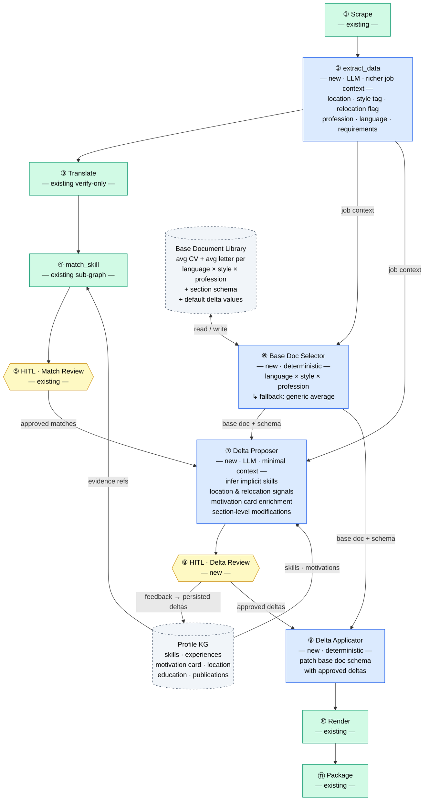

# Design Spec — Generate Documents: Base Document + Knowledge Graph Delta Approach

**Date:** 2026-03-31
**Scope:** Replace the current `generate_documents` node (full LLM-written CV + motivation letter) with a controlled delta-application system: a curated Base Document Library, a Profile Knowledge Graph, an LLM Delta Proposer operating on minimal context, a HITL Delta Review gate, and a deterministic Delta Applicator.

---

## 1. Core Idea

The current `generate_documents` node asks an LLM to write a full CV and motivation letter from scratch on every run. This produces inconsistent output, burns large context windows, and gives the operator no structured review point.

The replacement design decomposes the problem into three responsibilities:

1. **Base Document Library** — curated average CVs and motivation letters, organized by `language × style × profession`. Each base document has a companion **section schema** that maps document sections to Profile KG fields.
2. **Profile Knowledge Graph (KG)** — structured candidate representation with typed nodes (skills, experiences, motivations, location, education) and typed edges (`demonstrates`, `implies`, `motivates`).
3. **Delta pipeline** — an LLM proposes targeted KG modifications (not document text); a HITL gate approves them; a deterministic applicator renders the final documents by patching the base schema with approved deltas.

The LLM never writes prose. It proposes graph-level changes with justifications. The operator controls what enters the KG. The render output is deterministic given approved deltas.

---

## 2. Full Pipeline



---

## 3. Node-by-Node Design Decisions

### ① Scrape — existing, unchanged

### ② extract_data — new LLM node

Replaces / extends `extract_bridge`. Produces a richer `JobContext`:

- `location` + `relocation_required: bool`
- `style_tag`: one of `"startup"` | `"it_enterprise"` | `"consulting"` | `"academia"` | `"ngo"` | `"public_sector"`
- `profession_category`: free-text (e.g. `"data scientist"`, `"ML engineer"`, `"software engineer"`)
- `language`: ISO 639-1 code, inferred from posting content
- `requirements`: list of structured requirements (same contract as current `extract_bridge` output)
- `company_name`, `contact_info` if extractable

Basis: `JobUnderstandingExtract` from `extract_understand` (dev branch) is the starting model to extend.

### ③ Translate — existing verify-only, unchanged

### ④ match_skill — existing sub-graph, unchanged

Continues to match `JobContext.requirements` against Profile KG evidence.

### ⑤ HITL Match Review — existing, unchanged

### ⑥ Base Doc Selector — new, deterministic

Selects from the Base Document Library using `language × style_tag × profession_category`.

Fallback chain:
1. Exact match: `language` + `style_tag` + profession bucket
2. `language` + `style_tag` only
3. `language` only
4. Final fallback: `"generic"` (the "averagest average")

The selector reads from the Base Document Library and returns both the base document and its section schema to downstream nodes.

### ⑦ Delta Proposer — new LLM node

Receives minimal context:
- Approved match results (skill refs + evidence + patches)
- `JobContext` (style tag, location, relocation flag)
- Profile KG subset — only nodes relevant to matched skills + motivations
- Base document section schema (the slots that can be filled)

Produces `DeltaProposal[]`. Each delta targets a specific KG node and proposes one of:
- `add`: new node (e.g. implied skill inferred from evidence)
- `modify`: change a field on an existing node (e.g. add relocation willingness to the location node)
- `enrich_motivation`: link an experience node to a motivation card entry

The LLM proposes graph-level changes with justifications. It does not write any document prose.

### ⑧ HITL Delta Review — new

Operator reviews each `DeltaProposal` (approve / modify / reject). Approved deltas are:
1. Written back to the Profile KG as persisted deltas — future runs benefit automatically.
2. Passed to the Delta Applicator for this run.

Basis: `DecisionEnvelope` / `ParsedDecision` from the dev branch is the starting contract.

### ⑨ Delta Applicator — new, deterministic

Applies approved deltas to the base document section schema. Produces `AssembledDocument` with filled-in sections for CV and motivation letter. No LLM involved.

### ⑩ Render — existing, unchanged

Receives `AssembledDocument` sections. `RenderCoordinator` handles PDF/DOCX output as today.

### ⑪ Package — existing, unchanged

---

## 4. Profile Knowledge Graph

Based on `CvProfileGraphPayload` from `src/interfaces/api/models.py` (dev branch):

```python
CvEntry             # id, category, essential, fields{}, descriptions: list[CvDescription]
CvSkill             # id, label, category, essential, level, meta{}
CvDemonstratesEdge  # id, source (entry_id), target (skill_id), description_keys[]
```

Extended with two new node types:

- **`MotivationCard`**: list of `MotivationEntry(experience_id, motivation_text, weight)` — maps experience nodes to motivation card sections in the generated letter.
- **`LocationNode`**: `city`, `country`, `willing_to_relocate: bool`, `target_cities: list[str]`.

---

## 5. Base Document Library — German Motivation Letter

The German motivation letter has a well-defined fixed structure (reference: https://www.simplegermany.com/german-cover-letter/):

| # | Section | Population method |
|---|---|---|
| 1 | Sender block — name, address, contact | Deterministic from profile |
| 2 | Receiver block — company, contact person, address | Deterministic from `JobContext` |
| 3 | Date + place | Deterministic |
| 4 | Subject line — `Bewerbung als [Stelle]` | Deterministic from `JobContext` |
| 5 | Salutation — `Sehr geehrte/r [Name]` or `Sehr geehrte Damen und Herren` | Deterministic with fallback |
| 6 | Intro paragraph — why this company, hook | Delta Proposer fills via KG delta |
| 7 | Core argument paragraph — key relevant experience + skills | Delta Proposer fills via KG delta |
| 8 | Alignment paragraph — specific fit for this role | Delta Proposer fills via KG delta |
| 9 | Closing paragraph — availability, CTA | Delta Proposer fills via KG delta |
| 10 | Formal closing — `Mit freundlichen Grüßen` | Deterministic |

Sections 1–5 and 10 are populated deterministically from the profile and `JobContext`. Sections 6–9 are the variable slots targeted by the Delta Proposer.

---

## 6. Sub-projects

This design spans three independent sub-projects. Each gets its own execution plan.

### Sub-project A — Profile KG Formalization

- Extend `CvProfileGraphPayload` with `MotivationCard` and `LocationNode`.
- Formalize the mapping from `profile_base_data.json` to the KG.
- Write migration tooling.

### Sub-project B — Base Document Library + extract_data

- Define the base document schema format.
- Create the first base documents: German motivation letter, generic CV.
- Build the `extract_data` LLM node (extends `JobUnderstandingExtract`).
- Build the deterministic `Base Doc Selector`.

### Sub-project C — Delta Proposer + Delta Applicator + HITL Delta Review

- Build the LLM Delta Proposer node.
- Build the HITL Delta Review gate (new TUI screen).
- Build the deterministic Delta Applicator.
- Wire into the main pipeline graph, replacing `generate_documents`.

---

## 7. What This Replaces

| Existing | Replaced by |
|---|---|
| `src/core/ai/generate_documents/` | Sub-project C |
| `src/graph/nodes/generate_documents.py` | Sub-project C |
| `extract_bridge` logic | Sub-project B (`extract_data`) |

---

## 8. Existing Contracts to Reuse (dev branch)

- `JobUnderstandingExtract` from `extract_understand` — basis for `JobContext`
- `CvProfileGraphPayload` in `src/interfaces/api/models.py` — basis for Profile KG
- `DecisionEnvelope` / `ParsedDecision` — basis for Delta Review contracts
- `GraphState` in `src/core/graph/state.py` — keep the thin control-plane pattern
