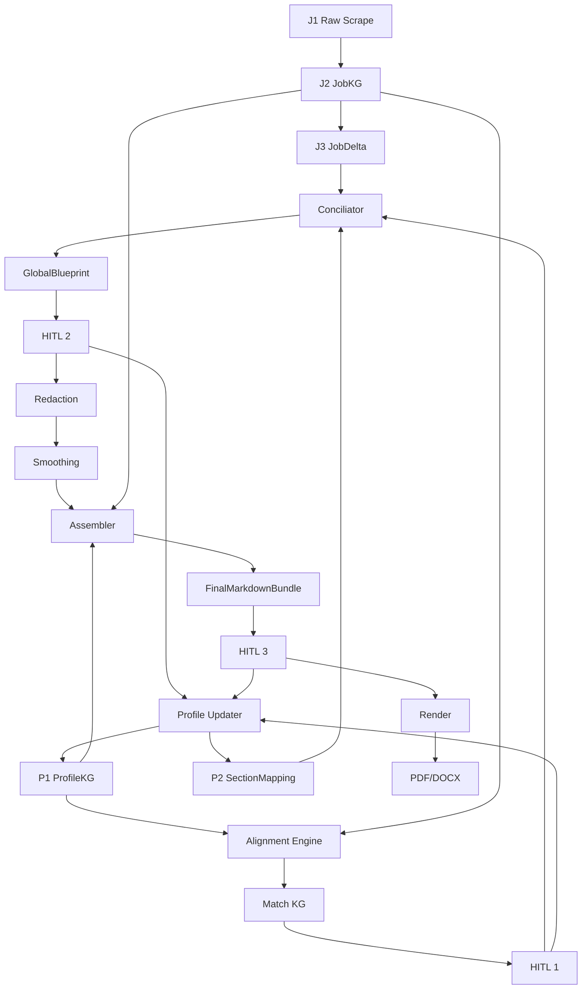

# Generate Documents - Graph Spec

**Date:** 2026-03-31
**Scope:** Grafo funcional del pipeline, etapas, entradas, salidas y responsabilidades por nodo.

---

## 1. Proposito

Este documento describe el grafo de generacion de documentos como sistema de etapas separadas. La idea central es desacoplar:
- inteligencia semantica
- redaccion
- ensamblado logico
- render fisico
- aprendizaje posterior

---

## 2. Flujo General

```text
J1 -> J2 -> J3
P1 + J2 -> Matching -> HITL 1
P2 + J3 + Match aprobado -> Blueprint -> HITL 2
Blueprint -> Drafting -> Smoothing
Drafts + P1 + J2 -> Assembly -> Markdown Bundle -> HITL 3
Markdown aprobado -> Render -> PDF/DOCX
HITL 1/2/3 -> Profile Updater -> P1/P2
```

---

## 3. Nodos del Grafo

## 3.1 Ingestion and Extraction

**Entrada**
- `J1` raw scrape

**Responsabilidad**
- extraer entidades
- separar hard requirements, soft context y logistica
- preparar datos estructurados de empresa y puesto

**Salida**
- `J2 / JobKG`

---

## 3.2 Requirement Filter

**Entrada**
- `J2`

**Responsabilidad**
- decidir que requisitos son criticos
- detectar que se puede ignorar o bajar de prioridad
- generar foco para la postulacion actual

**Salida**
- `J3 / JobDelta`

---

## 3.3 Alignment Engine

**Entrada**
- `P1 / ProfileKG`
- `J2 / JobKG`

**Responsabilidad**
- cruzar requerimientos del puesto con evidencia del perfil
- producir puentes semanticos entre job y candidato
- detectar huecos, afinidades y evidencia utilizable

**Salida**
- `Match KG`
- `MatchEdge`

---

## 3.4 HITL 1 - Match and Evidence

**Responsabilidad**
- aprobar o rechazar matches
- inyectar evidencia emergente
- corregir errores de alineacion tecnica o cultural

**Salida**
- delta de match aprobado
- posibles `GraphPatch`

---

## 3.5 Conciliator / Section Injector

**Entrada**
- `P2 / SectionMapping`
- `J3 / JobDelta`
- resultados aprobados de HITL 1

**Responsabilidad**
- elegir estrategia de documento
- decidir que hechos entran a cada seccion
- ordenar el tren de frases
- aplicar prioridades y descartes

**Salida**
- `SectionBlueprint`
- `GlobalBlueprint`

---

## 3.6 HITL 2 - Blueprint Logic

**Responsabilidad**
- validar orden de ideas
- mover secciones
- quitar redundancias
- agregar ideas omitidas

**Restriccion**
- corrige logica estructural, no prosa final

---

## 3.7 Redaction Node

**Entrada**
- blueprint aprobado

**Responsabilidad**
- convertir hechos ordenados en texto seccional
- respetar tono, documento y contexto regional

**Salida**
- `DraftedSection`

---

## 3.8 Smoothing Node

**Entrada**
- secciones redactadas

**Responsabilidad**
- suavizar transiciones
- mejorar conectores
- evitar sensacion de copy-paste

**Restriccion**
- no debe inventar nueva logica de contenido

**Salida**
- `DraftedDocument`

---

## 3.9 Assembler

**Entrada**
- drafts aprobables
- datos de `P1`
- datos de `J2`

**Responsabilidad**
- inyectar direccion, fecha, contactos y metadata
- compilar CV, carta y email en Markdown
- aplicar layout logico y secuencia de bloques

**Salida**
- `MarkdownDocument`
- `FinalMarkdownBundle`

---

## 3.10 HITL 3 - Content and Style

**Responsabilidad**
- revisar Markdown final
- corregir tono y estilo
- aprobar bundle final previo a render

**Salida**
- bundle aprobado
- posibles `GraphPatch`

---

## 3.11 Render

**Entrada**
- Markdown aprobado

**Responsabilidad**
- aplicar variables de estilo
- generar PDF/DOCX con Jinja2 + Pandoc

**Restriccion**
- no altera estrategia, facts ni orden semantico

---

## 3.12 Profile Updater

**Entrada**
- patches de HITL 1/2/3 con `persist_to_profile=True`

**Responsabilidad**
- actualizar `P1` con nueva evidencia
- actualizar `P2` con estrategia aprendida
- guardar preferencias tonales si aplica

**Ubicacion logica**
- fuera del camino critico de render

---

## 4. Invariantes del Grafo

- el matching no decide layout final
- el redactor no decide direccion ni metadata legal
- el assembler no redefine contenido semantico
- el render no corrige estrategia
- todo cambio persistente debe pasar por `Profile Updater`

---

## 5. Grafo de Referencia



---

## 6. Riesgos Operativos

- si `J2` sale pobre, todo el pipeline pierde foco
- si HITL 1 no captura evidencia emergente, se pierde diferenciacion
- si el assembler mezcla responsabilidad semantica, el pipeline se vuelve fragil
- si el render absorbe logica regional, se acopla de forma incorrecta
