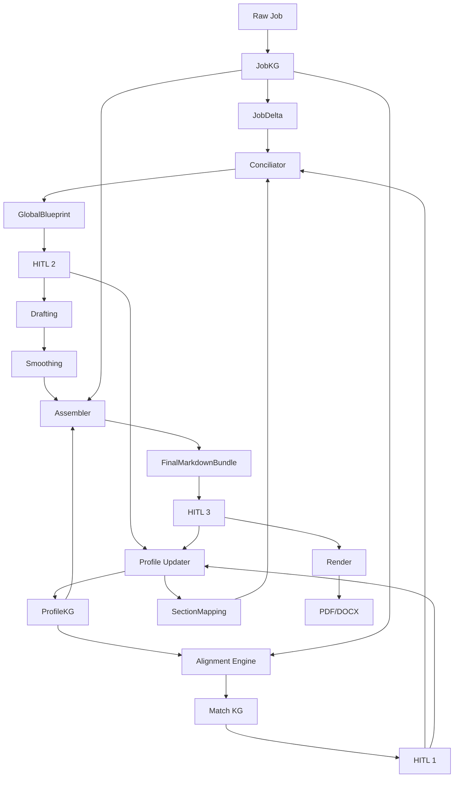

# Generate Documents - Consolidated Spec

**Date:** 2026-03-31
**Source:** `docs/superpowers/specs/2026-03-31-generate-documents-delta-design.md`
**Scope:** Especificacion funcional y tecnica del pipeline de generacion de CV, carta y email para postulaciones laborales y academicas.

---

## 1. Objetivo del Sistema

El sistema genera documentos de postulacion a partir de un perfil persistente y una oferta laboral efimera.

La logica central separa:
- **Macroplanning:** decide que ideas entran, en que orden y en que seccion.
- **Microplanning:** redacta y suaviza el contenido.
- **Assembly:** compone documentos Markdown completos.
- **Render:** convierte Markdown aprobado en PDF o DOCX.

El sistema no debe inventar texto libre sin soporte. Debe trabajar sobre hechos rastreables (`IdeaFact`) y contratos estrictos entre nodos.

---

## 2. Artefactos de Estado

### 2.1 Perfil (`P_n`) - Persistente

- **`P1 / ProfileKG`**
  - Experiencias
  - Skills normalizadas
  - Traits, hobbies, metas
  - Evidencia y relaciones entre nodos

- **`P2 / SectionMapping`**
  - Estrategia de secciones por pais, tipo de documento y contexto
  - Prioridades por defecto
  - Tono objetivo
  - Reglas de inclusion y orden

- **`P3 / Generic Redacted`**
  - Base redactada o documentos promedio para sostener tono y estilo base

### 2.2 Job (`J_n`) - Efimero

- **`J1 / Raw Scrape`**
  - Texto crudo de la oferta

- **`J2 / JobKG`**
  - Hard requirements
  - Soft context, cultura, vibe
  - Logistica: ubicacion, visa, relocation, modalidad, contrato
  - Datos de empresa y contacto para documentos

- **`J3 / JobDelta`**
  - Requerimientos a enfatizar
  - Requerimientos ignorables
  - Instrucciones de foco para esta postulacion

---

## 3. Pipeline de Alto Nivel

### 3.1 Stage 1 - Ingestion y Refinamiento

**Entrada:** `J1`

**Proceso:**
- Extraer entidades desde la oferta
- Separar hard requirements, soft context y logistica
- Filtrar que es critico vs secundario

**Salida:** `J2`, `J3`

### 3.2 Stage 2 - Matching y Evidencia Emergente

**Entrada:** `P1`, `J2`

**Proceso:**
- Alinear skills, experiencias y rasgos del perfil con la oferta
- Construir conexiones semanticas entre requerimientos y evidencia del perfil
- Permitir inyeccion humana de evidencia emergente no presente en el KG

**Salida:** Match KG, `MatchEdge`, evidencia emergente aprobada

### 3.3 Stage 3 - Macroplanning / Blueprint

**Entrada:** `P2`, `J3`, salida de matching, correcciones de HITL 1

**Proceso:**
- Seleccionar estrategia de secciones
- Priorizar y descartar hechos
- Ordenar ideas por seccion segun intencion narrativa

**Salida:** `SectionBlueprint`, `GlobalBlueprint`

### 3.4 Stage 4 - Microplanning / Drafting / Smoothing

**Entrada:** Blueprint aprobado

**Proceso:**
- Redactar cada seccion segun estilo objetivo
- Suavizar transiciones entre parrafos y secciones
- Mantener coherencia transversal sin cambiar la logica base

**Salida:** `DraftedSection`, `DraftedDocument`

### 3.5 Stage 5 - Assembly

**Entrada:** Secciones redactadas, `P1`, `J2`

**Proceso:**
- Inyectar datos personales, direccion, contacto, fecha y metadata
- Armar CV, carta y email en Markdown
- Aplicar reglas de headers, footers y orden de bloques

**Salida:** `MarkdownDocument`, `FinalMarkdownBundle`

### 3.6 Stage 6 - Physical Render

**Entrada:** Markdown aprobado

**Proceso:**
- Aplicar variables de estilo via Jinja2
- Convertir a binario mediante Pandoc

**Salida:** PDF y/o DOCX

---

## 4. Puntos HITL

### 4.1 HITL 1 - Match and Emergent Evidence

- Aprueba o rechaza matches tecnicos
- Permite agregar evidencia emergente
- Puede crear nodos temporales de match para la postulacion actual
- Puede marcar feedback para persistencia futura

### 4.2 HITL 2 - Blueprint Logic

- Audita estrategia y orden del blueprint
- Permite reordenar ideas, quitar redundancias y agregar puntos faltantes
- Corrige logica estructural, no prosa final

### 4.3 HITL 3 - Content and Style

- Revisa CV, carta y email ya ensamblados en Markdown
- Ajusta tono, fluidez, narrativa y estilo final
- Puede disparar rerender sin rehacer etapas previas si el cambio es solo visual

---

## 5. Separacion de Responsabilidades

### 5.1 Conciliador

- Decide que hechos entran
- Decide orden y prioridad de los hechos
- Aplica estrategia regional y de documento
- Produce el blueprint

### 5.2 Redactor

- Expande hechos en texto
- Respeta tono y seccion objetivo
- No define metadata ni layout legal

### 5.3 Smoothing

- Ajusta conectores y transiciones
- Opera como editor de coherencia
- No agrega nueva logica de contenido

### 5.4 Assembler

- Nodo determinista
- Inyecta direcciones, encabezados, fecha, firma, bloques formales y metadata
- Compila 3 documentos Markdown: CV, carta y email

### 5.5 Render

- Nodo tecnico
- Toma Markdown aprobado
- Usa motor de plantillas y Pandoc
- No modifica estrategia ni contenido semantico

---

## 6. Contratos de Datos

### 6.1 Base y Trazabilidad

#### `TextAnchor`
- `document_id`
- `start_index`
- `end_index`
- `exact_quote`

#### `IdeaFact`
- `id`
- `provenance_refs`
- `core_content`
- `priority` (1-5)
- `status` (`keep`, `hide`, `merge`)
- `source_anchors` opcional

### 6.2 Perfil y Job

#### `ProfileKG`
- `entries`
- `skills`
- `traits`
- `evidence_edges`

#### `SectionMapping`
- `section_id`
- `target_document`
- `country_context`
- `mandatory`
- `default_priority`
- `style_guideline`
- `default_fact_ids` opcional
- `target_tone` opcional

#### `JobKG`
- `hard_requirements`
- `soft_context`
- `logistics`
- `source_anchors`

#### `JobDelta`
- `must_highlight_ids` o `must_highlight_skills`
- `ignored_requirements`
- `custom_instructions`
- `soft_vibe_requirements`
- `logistics_flags`

### 6.3 Matching y Blueprint

#### `MatchEdge`
- `requirement_id`
- `profile_evidence_ids`
- `match_score`
- `reasoning`

#### `SectionBlueprint`
- `section_id`
- `logical_train_of_thought`
- `section_intent`
- `target_style` opcional
- `word_count_target` opcional

#### `GlobalBlueprint`
- `application_id`
- `strategy_type`
- `abstract_sections` o `sections`

### 6.4 Drafting y Assembly

#### `DraftedSection`
- `section_id`
- `raw_markdown`
- `is_cohesive`
- `word_count`

#### `DraftedDocument`
- `doc_type`
- `sections_md`
- `cohesion_score`

#### `MarkdownDocument`
- `doc_type`
- `header_data`
- `body_markdown`
- `footer_data`

#### `FinalMarkdownBundle`
- `cv_md` o `cv_full_md`
- `letter_md` o `letter_full_md`
- `email_md` o `email_body_md`
- `metadata_summary` o `rendering_metadata`

### 6.5 Intervencion Humana

#### `GraphPatch`
- `action`: `approve`, `reject`, `modify`, `request_regeneration`, `move_to_document` / `move_to_doc`
- `target_stage` opcional
- `target_type` opcional
- `target_id`
- `new_value`
- `feedback_note`
- `persist_to_profile`

---

## 7. Flujo de Datos Canonico

1. `J1` -> `JobKG` (`J2`)
2. `ProfileKG` + `JobKG` -> `MatchEdge` / Match KG -> HITL 1
3. `SectionMapping` + `JobDelta` + Match aprobado -> `GlobalBlueprint` -> HITL 2
4. `GlobalBlueprint` -> `DraftedSection` / `DraftedDocument`
5. `DraftedDocument` + datos de contacto -> `FinalMarkdownBundle` -> HITL 3
6. `FinalMarkdownBundle` -> PDF / DOCX

---

## 8. Profile Updater

### 8.1 Rol

Nodo fuera del camino critico de render que persiste aprendizaje estructural, factual y tonal.

### 8.2 Entradas

- Parches de HITL 1
- Parches de HITL 2
- Parches de HITL 3
- Solo aplica si `persist_to_profile=True`

### 8.3 Efectos

- Actualiza `P1` con nueva evidencia o matices del perfil
- Actualiza `P2` con nuevas reglas de orden, secciones y estrategia
- Puede registrar preferencias de estilo para redacciones futuras

### 8.4 Tipos de aprendizaje

- **Aprendizaje de evidencia:** nueva experiencia, hobby, contexto o logro
- **Aprendizaje de mapeo:** cambios de seccion, orden o prioridad
- **Aprendizaje de estilo:** reemplazos tonales o preferencias narrativas

---

## 9. Configuraciones Regionales y de Dominio

### 9.1 Alemania - Profesional

**CV / Lebenslauf**
- Foto obligatoria
- Fecha de nacimiento
- Nacionalidad
- Firma
- Fechas en formato aleman
- Estructura tabulada o de cronologia clara

**Carta / Anschreiben**
- `Absender`
- `Empfangerbezeichnung`
- `Ort_Datum`
- `Betreffzeile`
- `Anrede`
- `Einleitung`
- `Hauptteil_1`
- `Hauptteil_2`
- `Schlusssatz`
- `Grussformel`
- `Anlagenverzeichnis`

**Email**
- Formalidad alta
- Puede incluir referencia de oferta

### 9.2 Chile - Profesional

**CV**
- Prioriza resumen ejecutivo
- Prioriza logros cuantificados
- Oculta edad y nacionalidad

**Carta**
- Propuesta de valor directa
- Enfoque en problemas inmediatos del empleador

**Email**
- Breve y ejecutivo

### 9.3 Academico

**CV**
- Publicaciones
- Proyectos de investigacion
- Docencia
- Becas y premios
- Referencias academicas

**Carta**
- Proposito del programa
- Background academico
- Investigacion actual
- Alineacion con supervisor o laboratorio
- Vision a futuro

---

## 10. Matriz de Secciones por Tipo de Documento

### 10.1 CV Profesional

- Header
- Summary
- Experience
- Education
- Skills
- Grants/Awards opcional
- Publications opcional
- References segun mercado

### 10.2 CV Academico

- Header / Afiliacion institucional
- Research Interests
- Research Experience
- Education con tesis
- Publications
- Teaching
- Grants/Awards
- Skills cientificos
- References academicas

### 10.3 Carta Profesional

- Contexto
- Match tecnico
- Soft fit
- Cierre

### 10.4 Carta Academica

- Proposito
- Background academico
- Investigacion actual
- Alineacion con supervisor
- Vision a futuro

---

## 11. Reglas de Seleccion de Estrategia

El sistema debe activar un perfil de secciones segun metadata del job.

### 11.1 Ejemplo - `Professional_German`

- Activa foto, firma y estado de visa
- Prioriza experiencia y technical match
- Usa layout conforme a DIN 5008

### 11.2 Ejemplo - `Academic_German`

- Activa publicaciones, proyectos, docencia y referencias academicas
- Busca alineacion con papers, supervisor o laboratorio

---

## 12. Reglas de Transformacion de Hechos

Un mismo `IdeaFact` puede expresarse distinto segun documento y contexto.

Ejemplo base:
- Hecho fuente: disene un algoritmo de optimizacion de rutas en Rust

Transformaciones posibles:
- **CV profesional:** foco en eficiencia y resultado
- **CV academico:** foco en metodologia
- **Carta academica:** foco en trayectoria intelectual

Esta transformacion debe ocurrir sin perder trazabilidad hacia el hecho original.

---

## 13. Grafo de Referencia

---

## 14. Resultado Esperado del Pipeline

- Bundle Markdown compuesto por CV, carta y email
- Revision humana en 3 puntos diferenciados
- Render final en PDF o DOCX
- Persistencia opcional del aprendizaje hacia perfil y estrategia

---

## 15. Notas de Implementacion Derivadas

- Los contratos deben ser estrictos y auditables
- El render debe quedar desacoplado de la logica semantica
- El assembler debe seguir siendo determinista
- El sistema debe soportar variantes regionales y academicas sin rehacer el pipeline
- La trazabilidad debe permitir ir desde cualquier frase final hacia su evidencia origen
