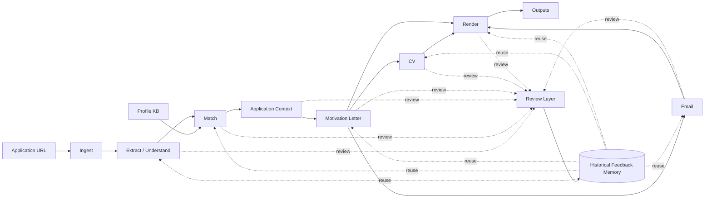

# Project Overview and Working Model

> Status note (2026-03-20): this overview is conceptually useful but not a precise mirror of the current runnable graph. It includes broader target-state phases and review loops beyond the operator-facing flow that runs today. For current runtime truth, use `README.md` and `docs/runtime/graph_flow.md`.

## What this project is

PhD 2.0 is a graph-driven application pipeline designed to create high-quality PhD application artifacts from real job postings and candidate profile data.

The pipeline combines:

- deterministic controls for structure, validation, provenance, and packaging,
- LLM generation for semantic tasks,
- human-in-the-loop review where judgment is required.

### Conceptual framing

PhD 2.0 is not just a document generator. A more accurate framing is:

> "Human-supervised application alignment system with reusable editorial memory."

Human review does not only correct the current artifact — it also writes reusable historical feedback that improves future applications across the system.

### System diagram

### Architectural layers

1. **Input layer**: URL, Profile knowledge base.
2. **Interpretation layer**: ingest, extraction, matching.
3. **Alignment layer**: review, feedback application, historical memory.
4. **Generation layer**: motivation letter, CV, email.
5. **Delivery layer**: render, outputs.

## Why this version exists

This workspace is a controlled rebuild. The previous implementation reached scaffold completeness without enough semantic depth in critical nodes. The rebuild resolves that by forcing each stage to be proven before continuing.

Main anti-failure goals:

1. prevent wax-model outputs,
2. prevent style and architecture drift,
3. make every approval and artifact auditable.

## System boundaries

## Deterministic boundary (`src/core`)

Handles:

- contracts and schema validation,
- input/output persistence,
- review markdown/json roundtrip,
- stale-state and decision validation,
- provenance and hash integrity,
- rendering and packaging.

## LLM boundary (`src/ai`)

Handles:

- generation nodes,
- prompt-local prompt assets,
- schema-constrained model parsing,
- graph routing around review decisions.

## Interface boundary (`src/interfaces`)

Handles:

- CLI commands for run/resume/review/status and operational flow.

## End-to-end behavior

At runtime, one job progresses through the graph with explicit state transitions.

High-level flow:

1. **Source acquisition**: scrape/import raw job artifacts.
2. **Deterministic normalization**: ingest/extract/translate.
3. **LLM generation with review gates**: match, context, motivation, CV, and email loops.
4. **Delivery**: render and package final outputs.

Reviewable nodes pause execution and require a validated decision before resuming.

Implementation note:

- the runtime should group related phases as subgraphs (macro-nodes), for example `prep_subgraph = ingest -> extract_understand -> translate` and review cycles such as `match -> review_match`.

## Operational model

Daily operation follows a run-review-resume loop:

1. run graph or target node,
2. inspect proposed artifacts,
3. provide review decisions where gates exist,
4. validate decision artifacts,
5. resume until the next gate or completion.

Execution governance and rollout sequencing are maintained in:

- `plan/archive/phd2_stepwise_plan.md`
- `plan/archive/index_checklist.md`

## Quality model

## Deterministic readiness

A deterministic component is ready only when:

1. contracts and validations pass,
2. expected artifacts are produced in canonical paths,
3. provenance metadata is correct,
4. human inspection confirms behavior.

## LLM readiness

An LLM component is ready only when:

1. shape/gating automation passes,
2. HITL semantic review on real jobs is approved,
3. no generic/hardcoded fallback output appears in approved artifacts.

## Failure philosophy

The system must fail closed instead of masking errors.

Examples:

- invalid review markdown must fail parse,
- stale review hash must block continuation,
- malformed model output must fail node execution,
- missing required artifacts must stop downstream nodes.

## What "done" means for this project

Project completion means:

1. the full graph path is stable from raw input to final package,
2. review loops and graph resumes are stable,
3. final render/package outputs are real and reproducible,
4. architecture boundaries remain intact,
5. changelog and documentation fully describe the resulting system.
