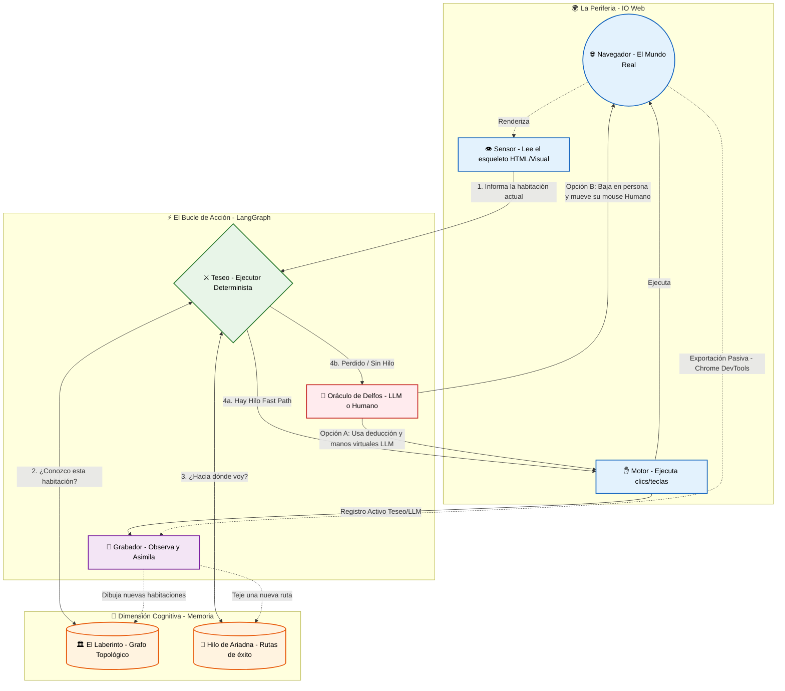
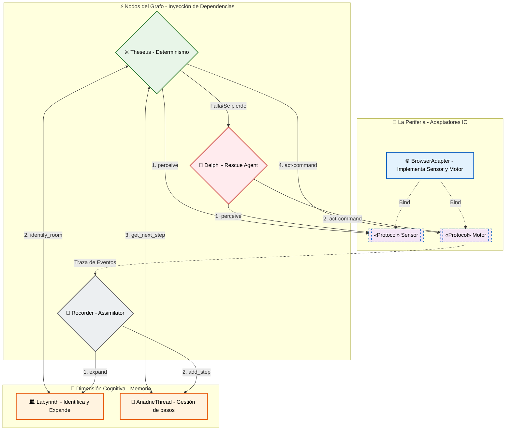

# Ariadne OOP Architecture Draft

This document captures a proposed object-oriented architecture for Ariadne, separating browser I/O, active memory, and LangGraph actors.

## Conceptual Flow



## OOP Direction

Pasar de funciones sueltas a un diseño orientado a objetos permite inyectar dependencias explícitas en los nodos de LangGraph y limpiar el uso de `config` como canal implícito de runtime state.

## 1. La Periferia (I/O)

Estos son los protocolos e implementaciones que tocan el navegador.

- `Sensor` (Protocol)
  - Rol: leer la realidad física y traducirla a un DTO.
  - Método clave: `async def perceive(self) -> SnapshotResult`
- `Motor` (Protocol)
  - Rol: ejecutar instrucciones primitivas sobre el navegador.
  - Método clave: `async def act(self, command: MotorCommand) -> ExecutionResult`
- `BrowserAdapter` (Clase concreta)
  - Rol: implementación real del navegador, heredando de `Sensor` y `Motor`.
  - Maneja el ciclo de vida real con `__aenter__` y `__aexit__`.

## 2. La Dimensión Cognitiva (Memoria)

La memoria se separa en dos clases activas.

- `Labyrinth`
  - Rol: entender dónde estamos.
  - Estado interno: grafo de `StateDefinition`.
  - Métodos clave:
    - `identify_room(snapshot: SnapshotResult) -> str`
    - `expand(new_room_data) -> None`
- `AriadneThread`
  - Rol: saber hacia dónde ir para una misión específica.
  - Estado interno: lista de transiciones dirigidas.
  - Método clave: `get_next_step(current_room_id: str) -> Command`

## 3. Los Actores (Nodos de LangGraph)

Los nodos pasan a ser instancias callables con dependencias inyectadas por constructor.

- `Theseus`
  - Rol: ejecutar el camino determinista y barato.
  - Dependencias: `Sensor`, `Motor`, `Labyrinth`, `AriadneThread`.
  - Flujo:
    1. `Sensor.perceive()`
    2. `Labyrinth.identify_room()`
    3. `AriadneThread.get_next_step()`
    4. `Motor.act()`
    5. Si falla o se pierde, deriva a Delfos.
- `Delphi`
  - Rol: rescate LLM/humano cuando Theseus se pierde.
  - Dependencias: `Sensor`, `Motor`, `LLM_Client`.
  - Flujo:
    1. observa con `Sensor`
    2. consulta al LLM con la pantalla cruda
    3. decide una acción visual
    4. ejecuta con `Motor`
- `Recorder`
  - Rol: asimilar eventos y actualizar memoria.
  - Dependencias: `Labyrinth`, `AriadneThread`, `TraceFile`.
  - Flujo:
    1. lee la acción ejecutada
    2. llama a `Labyrinth.expand()` si descubre una pantalla nueva
    3. llama a `AriadneThread.add_step()` para tejer la ruta futura

## LangGraph Wiring Example

```python
# 1. Instanciamos el mundo
adapter = Crawl4AIAdapter()
laberinto = Labyrinth.load_from_db("linkedin")
hilo = AriadneThread.load_from_db("linkedin", mission="easy_apply")

# 2. Instanciamos los actores
teseo = Theseus(sensor=adapter, motor=adapter, labyrinth=laberinto, thread=hilo)
delfos = Delphi(sensor=adapter, motor=adapter, llm_model="gemini-1.5-pro")
recorder = Recorder(labyrinth=laberinto, thread=hilo)

# 3. Armamos el grafo
workflow = StateGraph(AriadneState)
workflow.add_node("teseo", teseo)
workflow.add_node("delfos", delfos)
workflow.add_node("recorder", recorder)

workflow.set_entry_point("teseo")
workflow.add_conditional_edges(
    "teseo",
    route_after_teseo,
    {"recorder": "recorder", "delfos": "delfos"},
)
```

## Object Diagram



## Notes

- `orchestrator.py` becomes a dependency injector instead of a bucket of runtime wiring.
- `Theseus` no longer needs hidden config wiring for browser state.
- `Labyrinth` and `AriadneThread` become active memory objects rather than passive JSON blobs.
- `Recorder` becomes the universal assimilation layer for deterministic and exploratory action traces.
